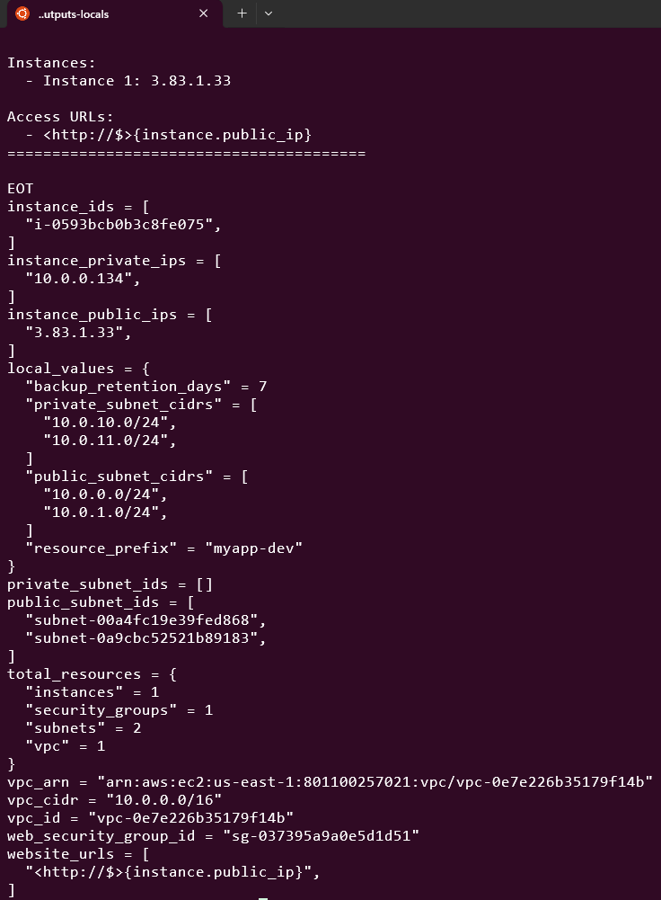

# Day 10: Output Values & Local Values

🧪 Hands-On Lab: Outputs & Locals

Let’s build a complete infrastructure using outputs and locals effectively!
# Step 1: Create Project Structure
```
mkdir terraform-outputs-locals
cd terraform-outputs-locals
```

# Step 2: Create variables.tf
```
# variables.tf

variable "aws_region" {
  description = "AWS region"
  type        = string
  default     = "us-east-1"
}

variable "project_name" {
  description = "Project name"
  type        = string
  default     = "webapp"
}

variable "environment" {
  description = "Environment (dev, staging, prod)"
  type        = string

  validation {
    condition     = contains(["dev", "staging", "prod"], var.environment)
    error_message = "Must be dev, staging, or prod."
  }
}

variable "vpc_cidr" {
  description = "VPC CIDR block"
  type        = string
  default     = "10.0.0.0/16"
}

variable "availability_zones" {
  description = "Availability zones"
  type        = list(string)
  default     = ["us-east-1a", "us-east-1b"]
}

variable "create_nat_gateway" {
  description = "Create NAT gateway for private subnets"
  type        = bool
  default     = false
}

variable "enable_monitoring" {
  description = "Enable detailed monitoring"
  type        = bool
  default     = false
}
```

# Step 3: Create locals.tf
```
# locals.tf

locals {
  # Naming convention
  resource_prefix = "${var.project_name}-${var.environment}"

  # Common tags
  common_tags = {
    Project     = var.project_name
    Environment = var.environment
    ManagedBy   = "Terraform"
    CreatedAt   = timestamp()
  }

  # Environment-specific configurations
  instance_type = {
    dev     = "t2.micro"
    staging = "t2.small"
    prod    = "t3.large"
  }

  instance_count = {
    dev     = 1
    staging = 2
    prod    = 3
  }

  # Network calculations
  public_subnet_cidrs = [
    for idx in range(length(var.availability_zones)) :
    cidrsubnet(var.vpc_cidr, 8, idx)
  ]

  private_subnet_cidrs = [
    for idx in range(length(var.availability_zones)) :
    cidrsubnet(var.vpc_cidr, 8, idx + 10)
  ]

  # Security group rules based on environment
  allowed_ssh_cidrs = var.environment == "prod" ? ["10.0.0.0/8"] : ["0.0.0.0/0"]

  # Conditional resource creation flags
  create_private_subnets = var.environment != "dev"
  enable_vpc_flow_logs   = var.environment == "prod"

  # Backup configuration
  backup_retention_days = {
    dev     = 7
    staging = 14
    prod    = 30
  }

  # Computed values
  all_subnet_cidrs = concat(local.public_subnet_cidrs, local.private_subnet_cidrs)
  total_subnets    = length(local.all_subnet_cidrs)

  # Feature flags
  features = {
    monitoring       = var.enable_monitoring
    nat_gateway      = var.create_nat_gateway
    private_subnets  = local.create_private_subnets
    flow_logs        = local.enable_vpc_flow_logs
  }
}
```

# Step 4: Create main.tf
```
# main.tf

terraform {
  required_version = ">= 1.0"
  required_providers {
    aws = {
      source  = "hashicorp/aws"
      version = "~> 5.0"
    }
  }
}

provider "aws" {
  region = var.aws_region

  default_tags {
    tags = local.common_tags
  }
}

# VPC
resource "aws_vpc" "main" {
  cidr_block           = var.vpc_cidr
  enable_dns_hostnames = true
  enable_dns_support   = true

  tags = {
    Name = "${local.resource_prefix}-vpc"
  }
}

# Internet Gateway
resource "aws_internet_gateway" "main" {
  vpc_id = aws_vpc.main.id

  tags = {
    Name = "${local.resource_prefix}-igw"
  }
}

# Public Subnets
resource "aws_subnet" "public" {
  count = length(var.availability_zones)

  vpc_id                  = aws_vpc.main.id
  cidr_block              = local.public_subnet_cidrs[count.index]
  availability_zone       = var.availability_zones[count.index]
  map_public_ip_on_launch = true

  tags = {
    Name = "${local.resource_prefix}-public-${count.index + 1}"
    Type = "Public"
  }
}

# Private Subnets (only in staging and prod)
resource "aws_subnet" "private" {
  count = local.create_private_subnets ? length(var.availability_zones) : 0

  vpc_id            = aws_vpc.main.id
  cidr_block        = local.private_subnet_cidrs[count.index]
  availability_zone = var.availability_zones[count.index]

  tags = {
    Name = "${local.resource_prefix}-private-${count.index + 1}"
    Type = "Private"
  }
}

# Public Route Table
resource "aws_route_table" "public" {
  vpc_id = aws_vpc.main.id

  route {
    cidr_block = "0.0.0.0/0"
    gateway_id = aws_internet_gateway.main.id
  }

  tags = {
    Name = "${local.resource_prefix}-public-rt"
  }
}

# Route Table Associations
resource "aws_route_table_association" "public" {
  count = length(aws_subnet.public)

  subnet_id      = aws_subnet.public[count.index].id
  route_table_id = aws_route_table.public.id
}

# Security Group
resource "aws_security_group" "web" {
  name        = "${local.resource_prefix}-web-sg"
  description = "Security group for web servers"
  vpc_id      = aws_vpc.main.id

  ingress {
    description = "HTTP"
    from_port   = 80
    to_port     = 80
    protocol    = "tcp"
    cidr_blocks = ["0.0.0.0/0"]
  }

  ingress {
    description = "HTTPS"
    from_port   = 443
    to_port     = 443
    protocol    = "tcp"
    cidr_blocks = ["0.0.0.0/0"]
  }

  ingress {
    description = "SSH"
    from_port   = 22
    to_port     = 22
    protocol    = "tcp"
    cidr_blocks = local.allowed_ssh_cidrs
  }

  egress {
    from_port   = 0
    to_port     = 0
    protocol    = "-1"
    cidr_blocks = ["0.0.0.0/0"]
  }

  tags = {
    Name = "${local.resource_prefix}-web-sg"
  }
}

# Data source for latest AMI
data "aws_ami" "amazon_linux" {
  most_recent = true
  owners      = ["amazon"]

  filter {
    name   = "name"
    values = ["amzn2-ami-hvm-*-x86_64-gp2"]
  }
}

# EC2 Instances
resource "aws_instance" "web" {
  count = local.instance_count[var.environment]

  ami                    = data.aws_ami.amazon_linux.id
  instance_type          = local.instance_type[var.environment]
  subnet_id              = aws_subnet.public[count.index % length(aws_subnet.public)].id
  vpc_security_group_ids = [aws_security_group.web.id]
  monitoring             = var.enable_monitoring

  user_data = <<-EOF
              #!/bin/bash
              yum update -y
              yum install -y httpd
              systemctl start httpd
              systemctl enable httpd
              echo "<h1>Instance ${count.index + 1} in ${var.environment}</h1>" > /var/www/html/index.html
              echo "<p>Deployed by Terraform</p>" >> /var/www/html/index.html
              EOF

  tags = {
    Name  = "${local.resource_prefix}-web-${count.index + 1}"
    Tier  = "Web"
    Index = count.index + 1
  }
}
```

# Step 5: Create outputs.tf
```
# outputs.tf

# VPC Outputs
output "vpc_id" {
  description = "ID of the VPC"
  value       = aws_vpc.main.id
}

output "vpc_cidr" {
  description = "CIDR block of the VPC"
  value       = aws_vpc.main.cidr_block
}

output "vpc_arn" {
  description = "ARN of the VPC"
  value       = aws_vpc.main.arn
}

# Network Outputs
output "public_subnet_ids" {
  description = "IDs of public subnets"
  value       = aws_subnet.public[*].id
}

output "private_subnet_ids" {
  description = "IDs of private subnets"
  value       = aws_subnet.private[*].id
}

output "all_subnet_ids" {
  description = "All subnet IDs"
  value       = concat(aws_subnet.public[*].id, aws_subnet.private[*].id)
}

# Instance Outputs
output "instance_ids" {
  description = "IDs of EC2 instances"
  value       = aws_instance.web[*].id
}

output "instance_public_ips" {
  description = "Public IPs of instances"
  value       = aws_instance.web[*].public_ip
}

output "instance_private_ips" {
  description = "Private IPs of instances"
  value       = aws_instance.web[*].private_ip
}

# Website URLs
output "website_urls" {
  description = "URLs to access instances"
  value = [
    for instance in aws_instance.web :
    "<http://$>{instance.public_ip}"
  ]
}

# Security Group Output
output "web_security_group_id" {
  description = "ID of web security group"
  value       = aws_security_group.web.id
}

# Environment Information
output "environment_config" {
  description = "Environment configuration summary"
  value = {
    environment    = var.environment
    region         = var.aws_region
    instance_type  = local.instance_type[var.environment]
    instance_count = local.instance_count[var.environment]
    features       = local.features
  }
}

# Computed Outputs
output "total_resources" {
  description = "Total count of resources created"
  value = {
    vpc               = 1
    subnets           = length(aws_subnet.public) + length(aws_subnet.private)
    instances         = length(aws_instance.web)
    security_groups   = 1
  }
}

# Infrastructure Summary
output "infrastructure_summary" {
  description = "Complete infrastructure summary"
  value = <<-EOT

    ========================================
    Infrastructure Deployment Summary
    ========================================
    Project: ${var.project_name}
    Environment: ${var.environment}
    Region: ${var.aws_region}

    VPC ID: ${aws_vpc.main.id}
    VPC CIDR: ${aws_vpc.main.cidr_block}

    Subnets:
    ${join("\\n", [for subnet in aws_subnet.public : "  - ${subnet.id} (${subnet.cidr_block})"])}

    Instances:
    ${join("\\n", [for idx, instance in aws_instance.web : "  - Instance ${idx + 1}: ${instance.public_ip}"])}

    Access URLs:
    ${join("\\n", [for instance in aws_instance.web : "  - <http://$>{instance.public_ip}"])}
    ========================================
  EOT
}

# Local Values Output (for debugging)
output "local_values" {
  description = "Local values for reference"
  value = {
    resource_prefix       = local.resource_prefix
    public_subnet_cidrs   = local.public_subnet_cidrs
    private_subnet_cidrs  = local.private_subnet_cidrs
    backup_retention_days = local.backup_retention_days[var.environment]
  }
}
```

# Step 6: Create terraform.tfvars
```
# terraform.tfvars

aws_region         = "us-east-1"
project_name       = "myapp"
environment        = "dev"
vpc_cidr           = "10.0.0.0/16"
availability_zones = ["us-east-1a", "us-east-1b"]
create_nat_gateway = false
enable_monitoring  = false
```

# Step 7: Deploy and Test

# Initialize
terraform init
# Plan
terraform plan
# Apply
terraform apply -auto-approve

Quick Fix:

Just remove the CreatedAt = timestamp() line from your locals.tf:
bash

# Edit locals.tf and remove the CreatedAt line
sed -i '/CreatedAt.*timestamp()/d' locals.tf
terraform apply -auto-approve


# View all outputs
terraform output




# View specific output
terraform output vpc_id


# View formatted summary
terraform output infrastructure_summary


# Get raw value for scripting
PUBLIC_IP=$(terraform output -json instance_public_ips | jq -r '.[0]')


# Step 8: Test Different Environments

Create prod.tfvars:
```
environment        = "prod"
vpc_cidr           = "172.16.0.0/16"
create_nat_gateway = true
enable_monitoring  = true
```

```
terraform plan -var-file="prod.tfvars"
```


Notice how locals change the configuration based on the environment!
# Step 9: Query Outputs Programmatically

# Get JSON output
terraform output -json > outputs.json

# Parse with jq
cat outputs.json | jq '.instance_public_ips.value'

# Use in scripts
terraform output -json | jq -r '.website_urls.value[]' | while read url; do  echo "Testing $url"  curl -I $urldone


# Step 10: Clean Up
```
terraform destroy -auto-approve
```


📝 Best Practices
Outputs

✅ DO:

Add descriptions to all outputs

Mark sensitive data with sensitive = true

Group related outputs logically

Use outputs to share data between configurations

Output useful debugging information

❌ DON’T:

Output unnecessary information

Forget to mark sensitive values

Use outputs for internal-only values (use locals)

Locals

✅ DO:

Use locals for repeated expressions

Name locals clearly and descriptively

Group related locals in locals blocks

Use locals for complex calculations

Document complex local expressions

❌ DON’T:

Overuse locals for simple values

Create overly complex local expressions

Use locals when a variable is more appropriate

📝 Summary

Today I learned:

✅ Output values and their purposes

✅ Different output types (simple, lists, maps, computed)

✅ Sensitive outputs

✅ Output dependencies

✅ Local values and when to use them

✅ Locals vs variables

✅ Organizing complex configurations
