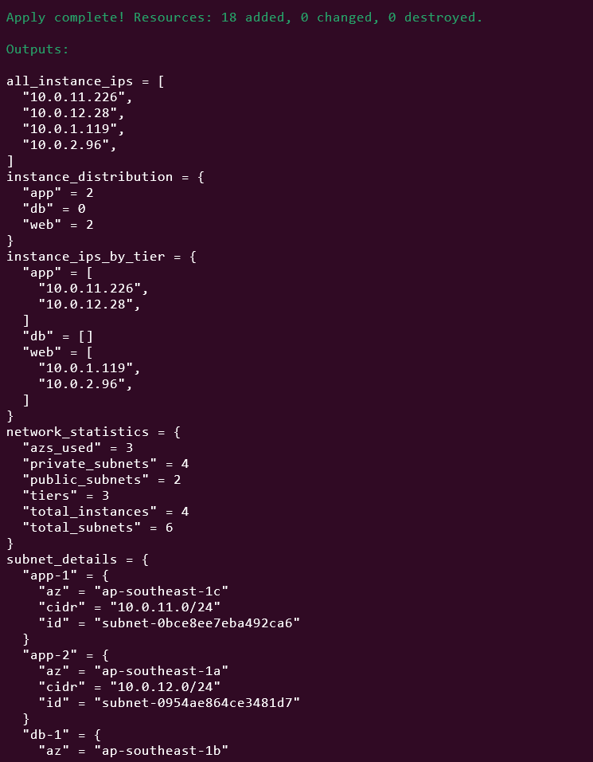
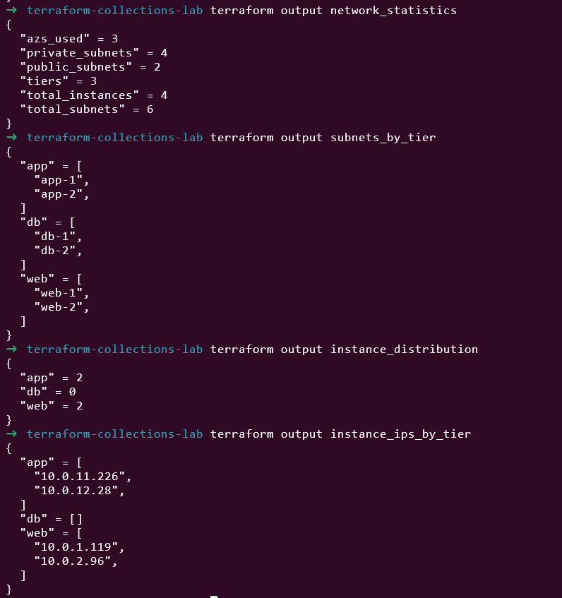
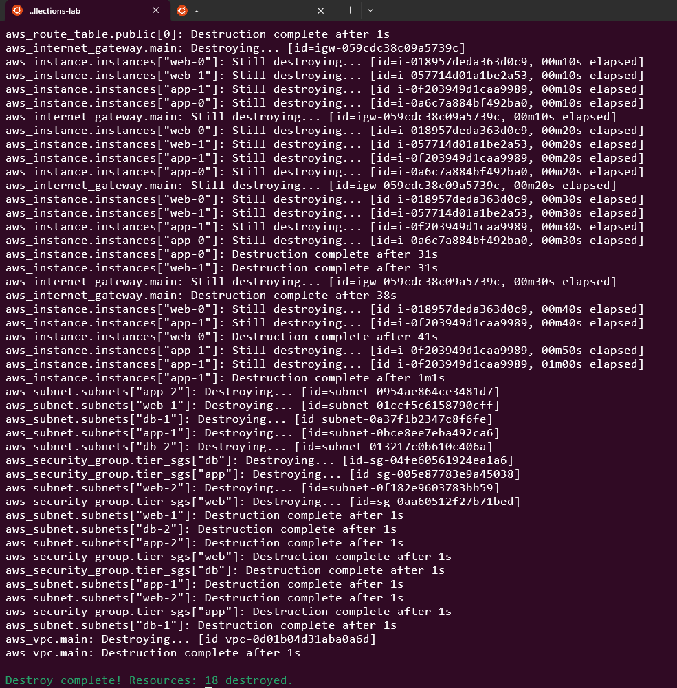

# Day 11: Working with Lists, Maps, and Sets

🧪 Hands-On Lab: Collection Mastery

Let’s build a complex infrastructure using advanced collection techniques!
# Step 1: Create Project

```
mkdir terraform-collections-lab
cd terraform-collections-lab
```

# Step 2: Create variables.tf
```
# variables.tf

variable "aws_region" {
  type    = string
  default = "us-east-1"
}

variable "project_name" {
  type    = string
  default = "collections-demo"
}

variable "availability_zones" {
  type    = list(string)
  default = ["us-east-1a", "us-east-1b", "us-east-1c"]
}

variable "subnet_configurations" {
  description = "List of subnet configurations"
  type = list(object({
    name = string
    cidr = string
    type = string
    tier = string
  }))

  default = [
    { name = "web-1", cidr = "10.0.1.0/24", type = "public", tier = "web" },
    { name = "web-2", cidr = "10.0.2.0/24", type = "public", tier = "web" },
    { name = "app-1", cidr = "10.0.11.0/24", type = "private", tier = "app" },
    { name = "app-2", cidr = "10.0.12.0/24", type = "private", tier = "app" },
    { name = "db-1", cidr = "10.0.21.0/24", type = "private", tier = "db" },
    { name = "db-2", cidr = "10.0.22.0/24", type = "private", tier = "db" }
  ]
}

variable "instance_configs" {
  description = "Instance configurations per tier"
  type = map(object({
    instance_type = string
    count         = number
    user_data     = string
  }))

  default = {
    web = {
      instance_type = "t2.micro"
      count         = 2
      user_data     = "#!/bin/bash\\necho 'Web Server' > /var/www/html/index.html"
    }
    app = {
      instance_type = "t2.small"
      count         = 2
      user_data     = "#!/bin/bash\\necho 'App Server'"
    }
  }
}

variable "common_tags" {
  type = map(string)
  default = {
    Project   = "Collections Demo"
    ManagedBy = "Terraform"
  }
}
```

# Step 3: Create locals.tf
```
# locals.tf

locals {
  # Filter subnets by type
  public_subnets = [
    for subnet in var.subnet_configurations :
    subnet if subnet.type == "public"
  ]

  private_subnets = [
    for subnet in var.subnet_configurations :
    subnet if subnet.type == "private"
  ]

  # Group subnets by tier
  subnets_by_tier = {
    for tier in distinct([for s in var.subnet_configurations : s.tier]) :
    tier => [
      for subnet in var.subnet_configurations :
      subnet if subnet.tier == tier
    ]
  }

  # Create subnet map for easy lookup
  subnet_map = {
    for subnet in var.subnet_configurations :
    subnet.name => subnet
  }

  # Get all tiers
  all_tiers = distinct([for s in var.subnet_configurations : s.tier])

  # Get all CIDR blocks
  all_cidrs = [for s in var.subnet_configurations : s.cidr]

  # Distribute subnets across AZs
  subnet_az_mapping = {
    for idx, subnet in var.subnet_configurations :
    subnet.name => var.availability_zones[idx % length(var.availability_zones)]
  }

  # Create security group rules matrix
  tier_connectivity = {
    web = ["app"]
    app = ["db"]
    db  = []
  }

  # Flatten instance deployments
  instance_deployments = flatten([
    for tier, config in var.instance_configs : [
      for i in range(config.count) : {
        tier          = tier
        index         = i
        instance_type = config.instance_type
        user_data     = config.user_data
        subnet        = local.subnets_by_tier[tier][i % length(local.subnets_by_tier[tier])].name
      }
    ]
  ])

  # Create deployment map
  deployment_map = {
    for deployment in local.instance_deployments :
    "${deployment.tier}-${deployment.index}" => deployment
  }

  # Calculate network statistics
  network_stats = {
    total_subnets    = length(var.subnet_configurations)
    public_subnets   = length(local.public_subnets)
    private_subnets  = length(local.private_subnets)
    tiers            = length(local.all_tiers)
    total_instances  = sum([for c in var.instance_configs : c.count])
    azs_used         = length(var.availability_zones)
  }

  # Merge tags for each tier
  tier_tags = {
    for tier in local.all_tiers :
    tier => merge(
      var.common_tags,
      { Tier = tier }
    )
  }
}
```

# Step 4: Create main.tf
```
# main.tf

terraform {
  required_providers {
    aws = {
      source  = "hashicorp/aws"
      version = "~> 5.0"
    }
  }
}

provider "aws" {
  region = var.aws_region
}

# VPC
resource "aws_vpc" "main" {
  cidr_block           = "10.0.0.0/16"
  enable_dns_hostnames = true

  tags = merge(var.common_tags, {
    Name = "${var.project_name}-vpc"
  })
}

# Internet Gateway
resource "aws_internet_gateway" "main" {
  vpc_id = aws_vpc.main.id

  tags = merge(var.common_tags, {
    Name = "${var.project_name}-igw"
  })
}

# Subnets using for_each
resource "aws_subnet" "subnets" {
  for_each = local.subnet_map

  vpc_id                  = aws_vpc.main.id
  cidr_block              = each.value.cidr
  availability_zone       = local.subnet_az_mapping[each.key]
  map_public_ip_on_launch = each.value.type == "public"

  tags = merge(local.tier_tags[each.value.tier], {
    Name = "${var.project_name}-${each.key}"
    Type = each.value.type
  })
}

# Route Table for Public Subnets
resource "aws_route_table" "public" {
  count = length(local.public_subnets) > 0 ? 1 : 0

  vpc_id = aws_vpc.main.id

  route {
    cidr_block = "0.0.0.0/0"
    gateway_id = aws_internet_gateway.main.id
  }

  tags = merge(var.common_tags, {
    Name = "${var.project_name}-public-rt"
  })
}

# Route Table Associations
resource "aws_route_table_association" "public" {
  for_each = {
    for subnet in local.public_subnets :
    subnet.name => aws_subnet.subnets[subnet.name].id
  }

  subnet_id      = each.value
  route_table_id = aws_route_table.public[0].id
}

# Security Groups per tier
resource "aws_security_group" "tier_sgs" {
  for_each = toset(local.all_tiers)

  name        = "${var.project_name}-${each.key}-sg"
  description = "Security group for ${each.key} tier"
  vpc_id      = aws_vpc.main.id

  egress {
    from_port   = 0
    to_port     = 0
    protocol    = "-1"
    cidr_blocks = ["0.0.0.0/0"]
  }

  tags = merge(local.tier_tags[each.key], {
    Name = "${var.project_name}-${each.key}-sg"
  })
}

# AMI Data Source
data "aws_ami" "amazon_linux" {
  most_recent = true
  owners      = ["amazon"]

  filter {
    name   = "name"
    values = ["amzn2-ami-hvm-*-x86_64-gp2"]
  }
}

# EC2 Instances
resource "aws_instance" "instances" {
  for_each = local.deployment_map

  ami                    = data.aws_ami.amazon_linux.id
  instance_type          = each.value.instance_type
  subnet_id              = aws_subnet.subnets[each.value.subnet].id
  vpc_security_group_ids = [aws_security_group.tier_sgs[each.value.tier].id]
  user_data              = each.value.user_data

  tags = merge(local.tier_tags[each.value.tier], {
    Name  = "${var.project_name}-${each.key}"
    Index = each.value.index
  })
}
```

# Step 5: Create outputs.tf
```
# outputs.tf

output "network_statistics" {
  description = "Network statistics"
  value       = local.network_stats
}

output "subnets_by_tier" {
  description = "Subnets grouped by tier"
  value = {
    for tier, subnets in local.subnets_by_tier :
    tier => [for s in subnets : s.name]
  }
}

output "subnet_details" {
  description = "Detailed subnet information"
  value = {
    for name, subnet in aws_subnet.subnets :
    name => {
      id   = subnet.id
      cidr = subnet.cidr_block
      az   = subnet.availability_zone
    }
  }
}

output "instance_distribution" {
  description = "Instances per tier"
  value = {
    for tier in local.all_tiers :
    tier => length([
      for key, inst in local.deployment_map :
      inst if inst.tier == tier
    ])
  }
}

output "instance_ips_by_tier" {
  description = "Instance IPs grouped by tier"
  value = {
    for tier in local.all_tiers :
    tier => [
      for key, instance in aws_instance.instances :
      instance.private_ip if local.deployment_map[key].tier == tier
    ]
  }
}

output "all_instance_ips" {
  description = "All instance IPs"
  value       = values(aws_instance.instances)[*].private_ip
}

output "tier_security_groups" {
  description = "Security group IDs per tier"
  value = {
    for tier, sg in aws_security_group.tier_sgs :
    tier => sg.id
  }
}
```

# Step 6: Deploy and Explore

# Initialize
terraform init
# Plan and review the collections magic!
terraform plan
# Apply
terraform apply -auto-approve



# View outputs
terraform output network_statistics
terraform output subnets_by_tier
terraform output instance_distribution
terraform output instance_ips_by_tier



# Clean up
terraform destroy -auto-approve




📝 Summary

Today I learned:

✅ For expressions (list, map transformations)

✅ Splat expressions for attribute extraction

✅ Essential collection functions

✅ Advanced filtering and grouping

✅ Complex data transformations

✅ Dynamic infrastructure patterns


This lab was built using [StackOps - Diary](https://stackopsdiary.site/day-11-working-with-lists-maps-and-sets).

**Note**: Today AWS US EAST Region is down, I replace with AP Region. This is for myself understanding.Let me explain this Terraform configuration in extreme detail. I'll walk through every component and what happens at each stage.

1. Variables Definition (variables.tf)

This is your configuration file - it defines ALL the inputs for your infrastructure.
Variable Breakdown:

`aws_region`

```
variable "aws_region" {
  type    = string
  default = "ap-southeast-1"  # This is Singapore region
}
```

**Purpose**: Tells AWS where to create all resources

**Why**: Different regions have different availability zones, pricing, and services

`availability_zones`

```
variable "availability_zones" {
  type    = list(string)
  default = ["ap-southeast-1a", "ap-southeast-1b", "ap-southeast-1c"]
}
```

**Purpose**: Defines which specific data centers to use within the region

**Why**: For high availability - if one AZ fails, others can handle traffic

**Note**: These are actual physical locations with separate power/cooling

`subnet_configurations` - **THIS IS CRITICAL**
```
variable "subnet_configurations" {
  type = list(object({
    name = string  # Unique identifier
    cidr = string  # IP range
    type = string  # "public" or "private"
    tier = string  # "web", "app", or "db"
  }))

  default = [
    # Web tier subnets (public)
    { name = "web-1", cidr = "10.0.1.0/24", type = "public", tier = "web" },
    { name = "web-2", cidr = "10.0.2.0/24", type = "public", tier = "web" },
    
    # App tier subnets (private)  
    { name = "app-1", cidr = "10.0.11.0/24", type = "private", tier = "app" },
    { name = "app-2", cidr = "10.0.12.0/24", type = "private", tier = "app" },
    
    # Database tier subnets (private)
    { name = "db-1", cidr = "10.0.21.0/24", type = "private", tier = "db" },
    { name = "db-2", cidr = "10.0.22.0/24", type = "private", tier = "db" }
  ]
}
```

Understanding CIDR Blocks:

10.0.1.0/24 means IP range from 10.0.1.1 to 10.0.1.254

/24 = 256 total IP addresses (254 usable)

The numbering scheme organizes by tier:

Web: 10.0.1.x and 10.0.2.x

App: 10.0.11.x and 10.0.12.x

DB: 10.0.21.x and 10.0.22.x 

`Instance_configs`

```
variable "instance_configs" {
  type = map(object({
    instance_type = string  # AWS instance size
    count         = number  # How many to create
    user_data     = string  # Startup script
  }))

  default = {
    web = {
      instance_type = "t2.micro"  # 1 vCPU, 1GB RAM - smallest/cheapest
      count         = 2           # Create 2 web servers
      user_data     = "#!/bin/bash\\necho 'Web Server' > /var/www/html/index.html"
    }
    app = {
      instance_type = "t2.small"  # 1 vCPU, 2GB RAM - slightly bigger
      count         = 2           # Create 2 app servers  
      user_data     = "#!/bin/bash\\necho 'App Server'"
    }
    # Note: No DB tier defined here - we might use RDS instead
  }
}
```

`common_tags`

```
variable "common_tags" {
  type = map(string)
  default = {
    Project   = "Collections Demo"
    ManagedBy = "Terraform"
    # These tags appear on EVERY AWS resource
    # Useful for cost tracking: "Show me all costs for Project=Collections Demo"
  }
}
```

2. Data Processing (locals.tf) - THE BRAIN

This file takes your variables and transforms them into structures that Terraform can easily use to create resources.
Key Local Values Explained:

`public_subnets` and `private_subnets`

```
public_subnets = [
  for subnet in var.subnet_configurations :
  subnet if subnet.type == "public"
]
```

**What it does**: Filters the full subnet list to only include public subnets

**Result:**
```
public_subnets = [
  { name = "web-1", cidr = "10.0.1.0/24", type = "public", tier = "web" },
  { name = "web-2", cidr = "10.0.2.0/24", type = "public", tier = "web" }
]
```

**subnets_by_tier** - VERY IMPORTANT
```
subnets_by_tier = {
  for tier in distinct([for s in var.subnet_configurations : s.tier]) :
  tier => [
    for subnet in var.subnet_configurations :
    subnet if subnet.tier == tier
  ]
}
```

Step by step:

`distinct([for s in var.subnet_configurations : s.tier])` → Gets unique tiers: `["web", "app", "db"]`

For each tier, filter subnets that belong to that tier

Result:

```
subnets_by_tier = {
  "web" = [
    { name = "web-1", cidr = "10.0.1.0/24", type = "public", tier = "web" },
    { name = "web-2", cidr = "10.0.2.0/24", type = "public", tier = "web" }
  ]
  "app" = [
    { name = "app-1", cidr = "10.0.11.0/24", type = "private", tier = "app" },
    { name = "app-2", cidr = "10.0.12.0/24", type = "private", tier = "app" }
  ]
  "db" = [
    { name = "db-1", cidr = "10.0.21.0/24", type = "private", tier = "db" },
    { name = "db-2", cidr = "10.0.22.0/24", type = "private", tier = "db" }
  ]
}
```

`subnet_az_mapping` - AZ Distribution Logic
```
subnet_az_mapping = {
  for idx, subnet in var.subnet_configurations :
  subnet.name => var.availability_zones[idx % length(var.availability_zones)]
}
```

How it works:

idx is the index (0, 1, 2, 3, 4, 5 for our 6 subnets)

% is modulo operator (gives remainder after division)

length(var.availability_zones) = 3 (we have 3 AZs)

So: idx % 3 cycles through 0, 1, 2, 0, 1, 2

Result:
```
subnet_az_mapping = {
  "web-1" = "ap-southeast-1a"  # idx 0 % 3 = 0 → AZ[0]
  "web-2" = "ap-southeast-1b"  # idx 1 % 3 = 1 → AZ[1]  
  "app-1" = "ap-southeast-1c"  # idx 2 % 3 = 2 → AZ[2]
  "app-2" = "ap-southeast-1a"  # idx 3 % 3 = 0 → AZ[0]
  "db-1"  = "ap-southeast-1b"  # idx 4 % 3 = 1 → AZ[1]
  "db-2"  = "ap-southeast-1c"  # idx 5 % 3 = 2 → AZ[2]
}
```

`instance_deployments` - **MOST COMPLEX BUT MOST IMPORTANT**
```
instance_deployments = flatten([
  for tier, config in var.instance_configs : [
    for i in range(config.count) : {
      tier          = tier
      index         = i
      instance_type = config.instance_type
      user_data     = config.user_data
      subnet        = local.subnets_by_tier[tier][i % length(local.subnets_by_tier[tier])].name
    }
  ]
])
```

Let's trace through this step by step:

First loop: `for tier, config in var.instance_configs`

Tier: `"web"`, Config: `{instance_type: "t2.micro", count: 2, user_data: "..."}`

Tier: `"app"`, Config: `{instance_type: "t2.small", count: 2, user_data: "..."}`

Second loop: `for i in range(config.count)`

For web: `i = 0` and `i = 1` **(because count = 2)**

For app: `i = 0` and `i = 1` **(because count = 2)**

`Subnet assignment logic: local.subnets_by_tier[tier][i % length(local.subnets_by_tier[tier])].name`

For web tier: `local.subnets_by_tier["web"]` has 2 subnets

`i % length(...)` = `i % 2` → **cycles through 0, 1**

So: web instance **0** gets subnet at index **0** (`web-1`)

web instance **1** gets subnet at index **1** (`web-2`)

Result after flatten:
```
instance_deployments = [
  # Web tier instances
  { tier = "web", index = 0, instance_type = "t2.micro", user_data = "...", subnet = "web-1" },
  { tier = "web", index = 1, instance_type = "t2.micro", user_data = "...", subnet = "web-2" },
  
  # App tier instances  
  { tier = "app", index = 0, instance_type = "t2.small", user_data = "...", subnet = "app-1" },
  { tier = "app", index = 1, instance_type = "t2.small", user_data = "...", subnet = "app-2" }
]
```

`deployment_map` - Final structure for Terraform
```
deployment_map = {
  for deployment in local.instance_deployments :
  "${deployment.tier}-${deployment.index}" => deployment
}
```

Result:
```
deployment_map = {
  "web-0" = { tier = "web", index = 0, instance_type = "t2.micro", user_data = "...", subnet = "web-1" }
  "web-1" = { tier = "web", index = 1, instance_type = "t2.micro", user_data = "...", subnet = "web-2" }
  "app-0" = { tier = "app", index = 0, instance_type = "t2.small", user_data = "...", subnet = "app-1" }
  "app-1" = { tier = "app", index = 1, instance_type = "t2.small", user_data = "...", subnet = "app-2" }
}
```

3. Resource Creation (main.tf) - THE BUILDER

Now Terraform uses all the processed data to create actual AWS resources.
Resource Creation Flow:

1. VPC Creation

```
resource "aws_vpc" "main" {
  cidr_block = "10.0.0.0/16"  # This encompasses ALL our subnets
  # 10.0.0.0/16 = 10.0.0.1 to 10.0.255.254 (65,536 IPs)
}
```

2. Internet Gateway

Attached to VPC to allow internet access

3. Subnet Creation - USING `for_each`

```
resource "aws_subnet" "subnets" {
  for_each = local.subnet_map  # Creates one subnet for each of the 6 entries

  vpc_id            = aws_vpc.main.id
  cidr_block        = each.value.cidr  # The CIDR from our config
  availability_zone = local.subnet_az_mapping[each.key]  # The AZ we calculated
  map_public_ip_on_launch = each.value.type == "public"  # TRUE for web tier
}
```

Creates 6 actual AWS subnets with the exact specifications we defined

4. Route Table for Public Subnets

Creates a route table with route: 0.0.0.0/0 → Internet Gateway

Associates this route table with ALL public subnets (web-1, web-2)

5. Security Groups - ONE PER TIER
```
resource "aws_security_group" "tier_sgs" {
  for_each = toset(local.all_tiers)  # Creates 3 SGs: web, app, db

  name        = "${var.project_name}-${each.key}-sg"
  vpc_id      = aws_vpc.main.id
  
  # Default: Allow ALL outbound traffic
  egress {
    from_port   = 0
    to_port     = 0 
    protocol    = "-1"  # All protocols
    cidr_blocks = ["0.0.0.0/0"]
  }
}
```

Note: No inbound rules defined yet - you'd add these based on the `tier_connectivity` matrix

6. EC2 Instance Creation - THE FINAL STEP
```
resource "aws_instance" "instances" {
  for_each = local.deployment_map  # Creates 4 instances: web-0, web-1, app-0, app-1

  ami           = data.aws_ami.amazon_linux.id  # Finds latest Amazon Linux
  instance_type = each.value.instance_type      # "t2.micro" or "t2.small"
  
  # CRITICAL: Places instance in correct subnet
  subnet_id     = aws_subnet.subnets[each.value.subnet].id
  
  # CRITICAL: Attaches correct security group
  vpc_security_group_ids = [aws_security_group.tier_sgs[each.value.tier].id]
  
  user_data     = each.value.user_data  # Startup script
}
```

4. Final Infrastructure State

After `terraform apply`, you get:
```
VPC: 10.0.0.0/16 (collections-demo-vpc)
│
├── Availability Zone: ap-southeast-1a
│   ├── Public Subnet: web-1 (10.0.1.0/24)
│   │   └── EC2 Instance: collections-demo-web-0 (t2.micro)
│   ├── Private Subnet: app-2 (10.0.12.0/24) 
│   │   └── EC2 Instance: collections-demo-app-1 (t2.small)
│   └── Private Subnet: db-1 (10.0.21.0/24) [Empty - no instances]
│
├── Availability Zone: ap-southeast-1b  
│   ├── Public Subnet: web-2 (10.0.2.0/24)
│   │   └── EC2 Instance: collections-demo-web-1 (t2.micro)
│   ├── Private Subnet: app-1 (10.0.11.0/24)
│   │   └── EC2 Instance: collections-demo-app-0 (t2.small)
│   └── Private Subnet: db-2 (10.0.22.0/24) [Empty - no instances]
│
└── Availability Zone: ap-southeast-1c
    ├── [No web tier - only 2 web subnets]
    ├── [No app tier - only 2 app subnets] 
    └── [No db tier - only 2 db subnets]
```
