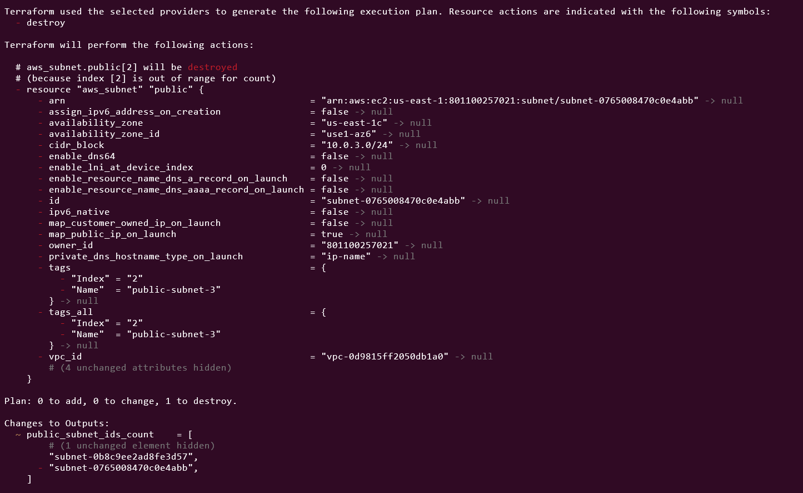
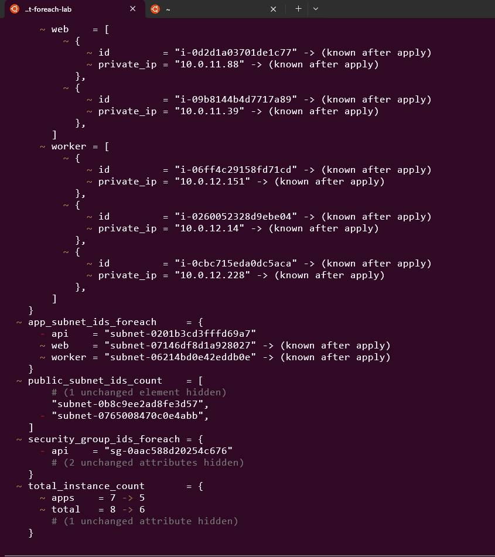

# Day 12: Count and For_Each - Creating Multiple Resources

🧪 Hands-On Lab: Count vs For_Each

Let’s build infrastructure demonstrating both approaches!
# Step 1: Create Project
```
mkdir terraform-count-foreach-lab
cd terraform-count-foreach-lab
```

# Step 2: Create variables.tf
```
# variables.tf

variable "aws_region" {
  type    = string
  default = "us-east-1"
}

variable "environment" {
  type    = string
  default = "dev"
}

# For count example
variable "public_subnet_count" {
  type    = number
  default = 3
}

variable "availability_zones" {
  type    = list(string)
  default = ["us-east-1a", "us-east-1b", "us-east-1c"]
}

# For for_each example
variable "applications" {
  type = map(object({
    instance_type = string
    desired_count = number
    port          = number
  }))

  default = {
    web = {
      instance_type = "t2.micro"
      desired_count = 2
      port          = 80
    }
    api = {
      instance_type = "t2.small"
      desired_count = 2
      port          = 8080
    }
    worker = {
      instance_type = "t2.micro"
      desired_count = 3
      port          = 0
    }
  }
}

variable "create_bastion" {
  type    = bool
  default = true
}
```

# Step 3: Create main.tf
```
# main.tf

terraform {
  required_providers {
    aws = {
      source  = "hashicorp/aws"
      version = "~> 5.0"
    }
  }
}

provider "aws" {
  region = var.aws_region
}

# VPC
resource "aws_vpc" "main" {
  cidr_block           = "10.0.0.0/16"
  enable_dns_hostnames = true

  tags = {
    Name = "count-foreach-demo-vpc"
  }
}

# Internet Gateway
resource "aws_internet_gateway" "main" {
  vpc_id = aws_vpc.main.id

  tags = {
    Name = "main-igw"
  }
}

# ============================================
# COUNT EXAMPLES
# ============================================

# Public Subnets using COUNT
resource "aws_subnet" "public" {
  count = var.public_subnet_count

  vpc_id                  = aws_vpc.main.id
  cidr_block              = "10.0.${count.index + 1}.0/24"
  availability_zone       = var.availability_zones[count.index % length(var.availability_zones)]
  map_public_ip_on_launch = true

  tags = {
    Name  = "public-subnet-${count.index + 1}"
    Index = count.index
  }
}

# Conditional Bastion using COUNT
resource "aws_instance" "bastion" {
  count = var.create_bastion ? 1 : 0

  ami           = data.aws_ami.amazon_linux.id
  instance_type = "t2.micro"
  subnet_id     = aws_subnet.public[0].id

  tags = {
    Name = "bastion-host"
  }
}

# ============================================
# FOR_EACH EXAMPLES
# ============================================

# Application-specific Subnets using FOR_EACH
locals {
  app_subnets = {
    for app_name in keys(var.applications) :
    app_name => {
      cidr_block = "10.0.${10 + index(keys(var.applications), app_name)}.0/24"
      az         = var.availability_zones[0]
    }
  }
}

resource "aws_subnet" "app_subnets" {
  for_each = local.app_subnets

  vpc_id            = aws_vpc.main.id
  cidr_block        = each.value.cidr_block
  availability_zone = each.value.az

  tags = {
    Name        = "${each.key}-subnet"
    Application = each.key
  }
}

# Security Groups using FOR_EACH
resource "aws_security_group" "app_sgs" {
  for_each = var.applications

  name        = "${each.key}-sg"
  description = "Security group for ${each.key}"
  vpc_id      = aws_vpc.main.id

  dynamic "ingress" {
    for_each = each.value.port > 0 ? [1] : []
    content {
      from_port   = each.value.port
      to_port     = each.value.port
      protocol    = "tcp"
      cidr_blocks = ["0.0.0.0/0"]
    }
  }

  egress {
    from_port   = 0
    to_port     = 0
    protocol    = "-1"
    cidr_blocks = ["0.0.0.0/0"]
  }

  tags = {
    Name        = "${each.key}-sg"
    Application = each.key
  }
}

# AMI Data Source
data "aws_ami" "amazon_linux" {
  most_recent = true
  owners      = ["amazon"]

  filter {
    name   = "name"
    values = ["amzn2-ami-hvm-*-x86_64-gp2"]
  }
}

# Application Instances using nested COUNT and FOR_EACH
locals {
  # Flatten applications into individual instances
  app_instances = flatten([
    for app_name, app_config in var.applications : [
      for i in range(app_config.desired_count) : {
        key           = "${app_name}-${i}"
        app_name      = app_name
        instance_type = app_config.instance_type
        index         = i
      }
    ]
  ])

  # Convert to map for for_each
  app_instances_map = {
    for inst in local.app_instances :
    inst.key => inst
  }
}

resource "aws_instance" "app_instances" {
  for_each = local.app_instances_map

  ami                    = data.aws_ami.amazon_linux.id
  instance_type          = each.value.instance_type
  subnet_id              = aws_subnet.app_subnets[each.value.app_name].id
  vpc_security_group_ids = [aws_security_group.app_sgs[each.value.app_name].id]

  user_data = <<-EOF
              #!/bin/bash
              echo "${each.value.app_name} instance ${each.value.index}" > /tmp/info.txt
              EOF

  tags = {
    Name        = each.key
    Application = each.value.app_name
    Index       = each.value.index
  }
}
```

# Step 4: Create outputs.tf
```
# outputs.tf

# COUNT outputs
output "public_subnet_ids_count" {
  description = "Public subnet IDs (created with count)"
  value       = aws_subnet.public[*].id
}

output "bastion_instance_id" {
  description = "Bastion instance ID (conditional with count)"
  value       = length(aws_instance.bastion) > 0 ? aws_instance.bastion[0].id : "Not created"
}

# FOR_EACH outputs
output "app_subnet_ids_foreach" {
  description = "App subnet IDs (created with for_each)"
  value = {
    for key, subnet in aws_subnet.app_subnets :
    key => subnet.id
  }
}

output "security_group_ids_foreach" {
  description = "Security group IDs (created with for_each)"
  value = {
    for key, sg in aws_security_group.app_sgs :
    key => sg.id
  }
}

output "app_instances_by_type" {
  description = "Instances grouped by application"
  value = {
    for app_name in keys(var.applications) :
    app_name => [
      for key, instance in aws_instance.app_instances :
      {
        id         = instance.id
        private_ip = instance.private_ip
      }
      if local.app_instances_map[key].app_name == app_name
    ]
  }
}

output "total_instance_count" {
  description = "Total number of instances"
  value = {
    bastion = var.create_bastion ? 1 : 0
    apps    = sum([for app in var.applications : app.desired_count])
    total   = (var.create_bastion ? 1 : 0) + sum([for app in var.applications : app.desired_count])
  }
}
```

# Step 5: Test Count Behavior

# Initialize
terraform init
# Applyt
terraform apply -auto-approve
# View outputs
terraform output

```
app_instances_by_type = {
  "api" = [
    {
      "id" = "i-08b5a1ae04a24b652"
      "private_ip" = "10.0.10.251"
    },
    {
      "id" = "i-00614ef11f8b0ea69"
      "private_ip" = "10.0.10.101"
    },
  ]
  "web" = [
    {
      "id" = "i-0d2d1a03701de1c77"
      "private_ip" = "10.0.11.88"
    },
    {
      "id" = "i-09b8144b4d7717a89"
      "private_ip" = "10.0.11.39"
    },
  ]
  "worker" = [
    {
      "id" = "i-06ff4c29158fd71cd"
      "private_ip" = "10.0.12.151"
    },
    {
      "id" = "i-0260052328d9ebe04"
      "private_ip" = "10.0.12.14"
    },
    {
      "id" = "i-0cbc715eda0dc5aca"
      "private_ip" = "10.0.12.228"
    },
  ]
}
app_subnet_ids_foreach = {
  "api" = "subnet-0201b3cd3fffd69a7"
  "web" = "subnet-07146df8d1a928027"
  "worker" = "subnet-06214bd0e42eddb0e"
}
bastion_instance_id = "i-05b47a1d00b5c8188"
public_subnet_ids_count = [
  "subnet-0643bc79990842eab",
  "subnet-0b8c9ee2ad8fe3d57",
  "subnet-0765008470c0e4abb",
]
security_group_ids_foreach = {
  "api" = "sg-0aac588d20254c676"
  "web" = "sg-00c1600cb077a201a"
  "worker" = "sg-0641d8b7b31e7aa78"
}
total_instance_count = {
  "apps" = 7
  "bastion" = 1
  "total" = 8
}
```

# Now test count index shift issue
# Modify variables.tf: change public_subnet_count from 3 to 2
# Plan again
```
terraform plan
```
# Notice: Terraform wants to destroy public[2]
# If resources depend on indices, this can be problematic!



# Step 6: Test For_Each Behavior

# Remove one application from variables.tf
# Change applications map to remove "api"
```
terraform plan
```
# Notice: Only "api" resources are destroyed
# "web" and "worker" are unchanged!



# Step 7: Clean Up
```
terraform destroy -auto-approve
```

📝 Best Practices
✅ DO:

Prefer for_each for named resources

for_each = toset(["web", "api", "worker"])

Use count for conditional creation

count = var.enabled ? 1 : 0

Use count for simple multiples

count = 5  # When you just need 5 identical things

Convert lists to sets for for_each

for_each = toset(var.list)

❌ DON’T:

Don’t use count with lists that might change

Don’t use both count and for_each together

Don’t make count/for_each depend on resource attributes

📝 Summary

Today I learned:

✅ Count meta-argument and count.index

✅ For_each meta-argument with maps and sets

✅ each.key and each.value

✅ When to use count vs for_each

✅ Common pitfalls and solutions

✅ Resource referencing patterns


This lab was built using [StackOps - Diary](https://stackopsdiary.site/day-12-count-and-foreach-creating-multiple-resources).