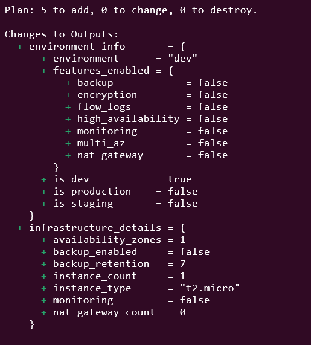
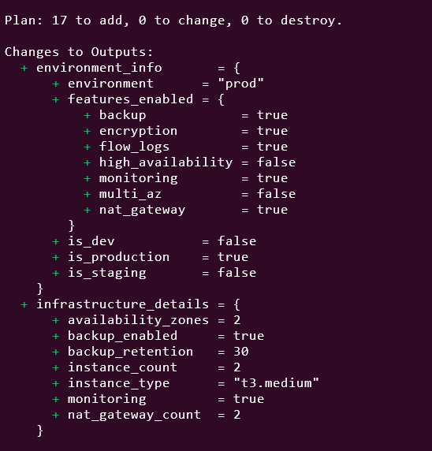

# Day 13: Conditional Expressions & Logic

🧪 Hands-On Lab: Conditional Infrastructure

Let’s build an environment-aware infrastructure!
# 🧱 Step 1: Create a New Project Folder

Open your terminal and create a new folder for this lab:
```
mkdir terraform-conditionals-lab
cd terraform-conditionals-lab
```

This will be your working directory for today’s exercise.
# 🧾 Step 2: Create variables.tf

This file defines all the inputs your Terraform configuration will use.
You’ll define variables like environment, monitoring, backup, etc.
```
# variables.tf

variable "aws_region" {
  type    = string
  default = "us-east-1"
}

variable "project_name" {
  type    = string
  default = "conditional-demo"
}

variable "environment" {
  description = "Environment (dev, staging, prod)"
  type        = string

  validation {
    condition     = contains(["dev", "staging", "prod"], var.environment)
    error_message = "Environment must be dev, staging, or prod."
  }
}

variable "enable_monitoring" {
  description = "Override monitoring setting"
  type        = bool
  default     = null
}

variable "enable_backup" {
  description = "Override backup setting"
  type        = bool
  default     = null
}

variable "multi_az" {
  description = "Deploy across multiple availability zones"
  type        = bool
  default     = false
}

variable "high_availability" {
  description = "Enable high availability features"
  type        = bool
  default     = false
}

variable "compliance_mode" {
  description = "Enable compliance features (encryption, logging, etc.)"
  type        = bool
  default     = false
}
```

🧠 Explanation:

These variables make your configuration flexible.

environment can only be one of dev, staging, or prod.

The null defaults for enable_backup and enable_monitoring let Terraform decide automatically based on the environment.

# 🧮 Step 3: Create locals.tf

This is where the conditional logic lives.
You’ll use locals to calculate derived values from variables (like how many instances to create or which subnet to use).
```
# locals.tf

locals {
  # Environment checks
  is_production = var.environment == "prod"
  is_staging    = var.environment == "staging"
  is_dev        = var.environment == "dev"

  # Auto-enable features
  monitoring_enabled = var.enable_monitoring != null ? var.enable_monitoring : local.is_production || local.is_staging
  backup_enabled     = var.enable_backup != null ? var.enable_backup : local.is_production

  # Instance configuration
  instance_config = {
    dev = {
      type  = "t2.micro"
      count = 1
    }
    staging = {
      type  = "t2.small"
      count = 2
    }
    prod = {
      type  = var.high_availability ? "t3.large" : "t3.medium"
      count = var.high_availability ? 3 : 2
    }
  }

  instance_type  = local.instance_config[var.environment].type
  instance_count = local.instance_config[var.environment].count

  # Network configuration
  create_nat_gateway = local.is_production || var.multi_az
  az_count          = var.multi_az ? 3 : (local.is_production ? 2 : 1)

  # Security and compliance
  enable_encryption = local.is_production || var.compliance_mode
  enable_flow_logs  = local.is_production || var.compliance_mode

  allowed_ssh_cidrs = local.is_dev ? ["0.0.0.0/0"] : ["10.0.0.0/8"]

  # Backup retention period
  backup_retention_days = (
    local.is_production ? 30 :
    local.is_staging ? 14 :
    7
  )

  # Common tags
  common_tags = merge(
    {
      Project     = var.project_name
      Environment = var.environment
      ManagedBy   = "Terraform"
    },
    local.is_production ? { Backup = "Required", Monitoring = "Enhanced" } : {},
    var.compliance_mode ? { Compliance = "Enabled" } : {}
  )

  # Feature flags summary
  features = {
    monitoring        = local.monitoring_enabled
    backup            = local.backup_enabled
    nat_gateway       = local.create_nat_gateway
    multi_az          = var.multi_az
    encryption        = local.enable_encryption
    flow_logs         = local.enable_flow_logs
    high_availability = var.high_availability
  }
}
```

💡 Explanation:

Terraform now knows which settings apply to each environment automatically.

For example:

In dev, only 1 small instance, no NAT, no backup.

In prod, multiple instances, NAT gateways, encryption, and longer backups.

# ☁️ Step 4: Create main.tf

This file defines your actual AWS resources using the conditionals you built.

```
# main.tf

terraform {
  required_providers {
    aws = {
      source  = "hashicorp/aws"
      version = "~> 5.0"
    }
  }
}

provider "aws" {
  region = var.aws_region

  default_tags {
    tags = local.common_tags
  }
}

data "aws_availability_zones" "available" {
  state = "available"
}

# 1️⃣ VPC
resource "aws_vpc" "main" {
  cidr_block           = "10.0.0.0/16"
  enable_dns_hostnames = true
  enable_dns_support   = true

  tags = { Name = "${var.project_name}-${var.environment}-vpc" }
}

# 2️⃣ Internet Gateway
resource "aws_internet_gateway" "main" {
  vpc_id = aws_vpc.main.id
  tags = { Name = "${var.project_name}-${var.environment}-igw" }
}

# 3️⃣ Public Subnets
resource "aws_subnet" "public" {
  count = local.az_count
  vpc_id            = aws_vpc.main.id
  cidr_block        = "10.0.${count.index + 1}.0/24"
  availability_zone = data.aws_availability_zones.available.names[count.index]
  map_public_ip_on_launch = true

  tags = {
    Name = "${var.project_name}-${var.environment}-public-${count.index + 1}"
    Type = "Public"
  }
}

# 4️⃣ Private Subnets (only for prod or multi-AZ)
resource "aws_subnet" "private" {
  count = local.is_production || var.multi_az ? local.az_count : 0
  vpc_id            = aws_vpc.main.id
  cidr_block        = "10.0.${count.index + 10}.0/24"
  availability_zone = data.aws_availability_zones.available.names[count.index]

  tags = {
    Name = "${var.project_name}-${var.environment}-private-${count.index + 1}"
    Type = "Private"
  }
}

# NAT Gateway (conditional)
resource "aws_nat_gateway" "main" {
  count = local.create_nat_gateway ? local.az_count : 0

  allocation_id = aws_eip.nat[count.index].id
  subnet_id     = aws_subnet.public[count.index].id

  tags = {
    Name = "${var.project_name}-${var.environment}-nat-${count.index + 1}"
  }
}

# Security Group with conditional rules
resource "aws_security_group" "web" {
  name        = "${var.project_name}-${var.environment}-web-sg"
  description = "Security group for web servers"
  vpc_id      = aws_vpc.main.id

  # HTTP - always allowed
  ingress {
    description = "HTTP"
    from_port   = 80
    to_port     = 80
    protocol    = "tcp"
    cidr_blocks = ["0.0.0.0/0"]
  }

  # HTTPS - always allowed
  ingress {
    description = "HTTPS"
    from_port   = 443
    to_port     = 443
    protocol    = "tcp"
    cidr_blocks = ["0.0.0.0/0"]
  }

  # SSH - conditional based on environment
  dynamic "ingress" {
    for_each = local.is_dev || local.is_staging ? [1] : []
    content {
      description = "SSH (Dev/Staging only)"
      from_port   = 22
      to_port     = 22
      protocol    = "tcp"
      cidr_blocks = local.allowed_ssh_cidrs
    }
  }

  egress {
    from_port   = 0
    to_port     = 0
    protocol    = "-1"
    cidr_blocks = ["0.0.0.0/0"]
  }

  tags = {
    Name = "${var.project_name}-${var.environment}-web-sg"
  }
}

# AMI Data Source
data "aws_ami" "amazon_linux" {
  most_recent = true
  owners      = ["amazon"]

  filter {
    name   = "name"
    values = ["amzn2-ami-hvm-*-x86_64-gp2"]
  }
}

# EC2 Instances
resource "aws_instance" "web" {
  count = local.instance_count

  ami           = data.aws_ami.amazon_linux.id
  instance_type = local.instance_type

  # Use private subnet in prod with NAT, public in dev/staging
  subnet_id = (local.is_production && local.create_nat_gateway) ? aws_subnet.private[count.index % length(aws_subnet.private)].id : aws_subnet.public[count.index % length(aws_subnet.public)].id

  vpc_security_group_ids = [aws_security_group.web.id]

  # Conditional monitoring
  monitoring = local.monitoring_enabled

  # Conditional EBS encryption
  root_block_device {
    encrypted   = local.enable_encryption
    volume_type = local.is_production ? "gp3" : "gp2"
    volume_size = local.is_production ? 30 : 20
  }

  user_data = <<-EOF
              #!/bin/bash
              yum update -y
              yum install -y httpd
              systemctl start httpd
              systemctl enable httpd
              echo "<h1>${var.environment} - Instance ${count.index + 1}</h1>" > /var/www/html/index.html
              echo "<p>Type: ${local.instance_type}</p>" >> /var/www/html/index.html
              echo "<p>Monitoring: ${local.monitoring_enabled}</p>" >> /var/www/html/index.html
              EOF

  tags = {
    Name  = "${var.project_name}-${var.environment}-web-${count.index + 1}"
    Tier  = "Web"
    Index = count.index + 1
  }
}

# VPC Flow Logs (conditional)
resource "aws_flow_log" "main" {
  count = local.enable_flow_logs ? 1 : 0

  iam_role_arn    = aws_iam_role.flow_logs[0].arn
  log_destination = aws_cloudwatch_log_group.flow_logs[0].arn
  traffic_type    = "ALL"
  vpc_id          = aws_vpc.main.id

  tags = {
    Name = "${var.project_name}-${var.environment}-flow-logs"
  }
}

# CloudWatch Log Group for Flow Logs (conditional)
resource "aws_cloudwatch_log_group" "flow_logs" {
  count = local.enable_flow_logs ? 1 : 0

  name              = "/aws/vpc/${var.project_name}-${var.environment}"
  retention_in_days = local.backup_retention_days

  tags = {
    Name = "${var.project_name}-${var.environment}-flow-logs"
  }
}

# IAM Role for Flow Logs (conditional)
resource "aws_iam_role" "flow_logs" {
  count = local.enable_flow_logs ? 1 : 0

  name = "${var.project_name}-${var.environment}-flow-logs-role"

  assume_role_policy = jsonencode({
    Version = "2012-10-17"
    Statement = [{
      Action = "sts:AssumeRole"
      Effect = "Allow"
      Principal = {
        Service = "vpc-flow-logs.amazonaws.com"
      }
    }]
  })
}

resource "aws_iam_role_policy" "flow_logs" {
  count = local.enable_flow_logs ? 1 : 0

  name = "flow-logs-policy"
  role = aws_iam_role.flow_logs[0].id

  policy = jsonencode({
    Version = "2012-10-17"
    Statement = [{
      Action = [
        "logs:CreateLogGroup",
        "logs:CreateLogStream",
        "logs:PutLogEvents",
        "logs:DescribeLogGroups",
        "logs:DescribeLogStreams"
      ]
      Effect   = "Allow"
      Resource = "*"
    }]
  })
}
```

💡 Explanation:

Terraform uses the local values to decide how many of each resource to create.

For example, NAT gateways only exist in prod or when multi_az is true.

SSH rules are added only in dev or staging for safety.

# 📤 Step 5: Create outputs.tf

Finally, you’ll add output blocks to display summary information after terraform apply.
```
# outputs.tf

output "environment_info" {
  description = "Environment configuration summary"
  value = {
    environment       = var.environment
    is_production     = local.is_production
    is_staging        = local.is_staging
    is_dev            = local.is_dev
    features_enabled  = local.features
  }
}

output "infrastructure_details" {
  description = "Infrastructure configuration"
  value = {
    instance_type       = local.instance_type
    instance_count      = local.instance_count
    availability_zones  = local.az_count
    monitoring          = local.monitoring_enabled
    backup_enabled      = local.backup_enabled
    backup_retention    = local.backup_retention_days
    nat_gateway_count   = local.create_nat_gateway ? local.az_count : 0
  }
}
```

When you run:

```
terraform apply -var="environment=staging"
```

Terraform will automatically:

Use smaller instances

Skip private subnets

Enable monitoring

Set backup retention to 14 days
All without changing a single line of code.


```
terraform destroy -var="environment=staging"
```

After test it, please delete resources.

🧠 Summary of the Lab
Environment	Instance Type	    NAT Gateway	    Backup	Monitoring
Dev	        t2.micro	            ❌	        ❌	    ❌
Staging	    t2.small	            ❌	        ✅	    ✅
Prod	    t3.medium/large	        ✅	        ✅	    ✅

✅ You’ve just built a dynamic, environment-aware Terraform project!

Now you can:

Use the same code for dev, staging, and prod

Let Terraform make smart choices based on variables

Simplify your infrastructure management

# Step 6: Test Different Environments

# Initialize
```
terraform init
```

# Test Development
```
terraform plan -var="environment=dev"
```



# Test Staging
```
terraform plan -var="environment=staging"
```


# Test Production
```
terraform plan -var="environment=prod"
```
# Test Production with High Availability
```
terraform plan -var="environment=prod" -var="high_availability=true"
```



# Apply development
```
terraform apply -var="environment=dev" -auto-approve
```


# View outputs
```
terraform output
```


# Clean up
```
terraform destroy -var="environment=dev" -auto-approve
```


📝 Summary

Today I learned:

✅ Conditional expressions (ternary operator)

✅ Comparison and logical operators

✅ Combining conditions with AND, OR, NOT

✅ Conditional resource creation

✅ Multi-way conditionals

✅ Building environment-aware infrastructure

This lab was built using [StackOps - Diary](https://stackopsdiary.site/day-13-conditional-expressions-and-logic).