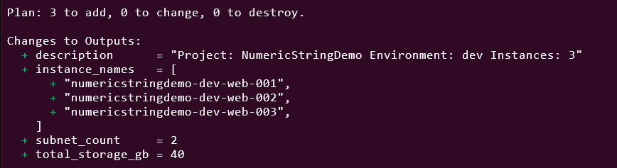
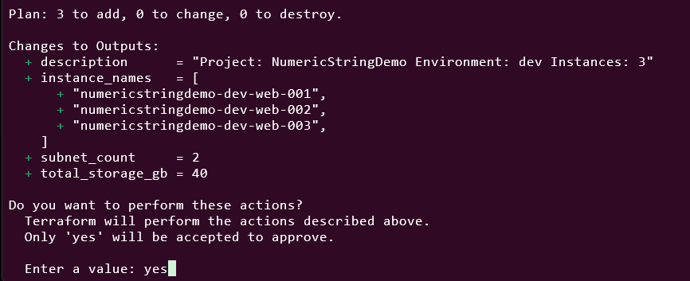
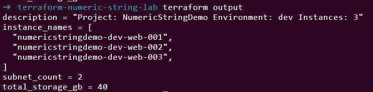
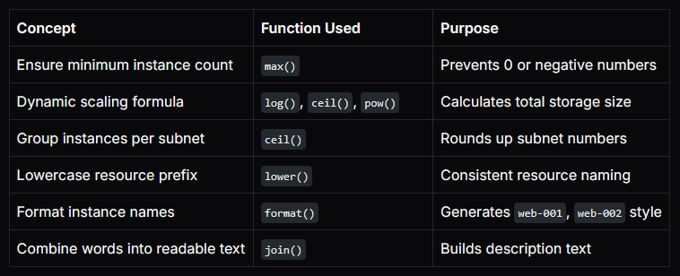

# Day 14: Built-in Functions in Terraform Part-I

🧪 Hands-On Lab
📁 Project Structure

🧰 Step 1: variables.tf

This file defines user inputs.
We’ll use variables for project naming, instance count, and region.

```
# variables.tf

variable "aws_region" {
  description = "AWS region where EC2 instances will be created"
  type        = string
  default     = "us-east-1"
}

variable "project_name" {
  description = "Name of your project"
  type        = string
  default     = "NumericStringDemo"
}

variable "environment" {
  description = "Deployment environment (dev, stage, prod)"
  type        = string
  default     = "dev"
}

variable "instance_count" {
  description = "Number of instances you want to create"
  type        = number
  default     = 3
}

variable "instance_type" {
  description = "EC2 instance type"
  type        = string
  default     = "t2.micro"
}

variable "base_storage" {
  description = "Base storage size (GB) for each instance"
  type        = number
  default     = 10
}
```

🧮 Step 2: locals.tf

Here’s where we use numeric and string functions to calculate and generate smart values.

```
# locals.tf

locals {
  # ✅ String Functions

  # Create a consistent lowercase prefix for all resources
  resource_prefix = "${lower(var.project_name)}-${lower(var.environment)}"
  # Example: "numericstringdemo-dev"

  # Format EC2 instance names dynamically
  instance_names = [
    for i in range(var.instance_count) :
    format("%s-web-%03d", local.resource_prefix, i + 1)
  ]
  # ["numericstringdemo-dev-web-001", "numericstringdemo-dev-web-002", ...]

  # ✅ Numeric Functions

  # Ensure we have at least 1 instance
  final_instance_count = max(1, var.instance_count)

  # Calculate total storage: power of 2 * base storage
  # e.g., if count=3 => ceil(log(3,2))=2 => pow(2,2)=4 => 4 * 10 = 40GB total
  total_storage_gb = pow(2, ceil(log(local.final_instance_count, 2))) * var.base_storage

  # Divide instances into subnets (2 per subnet, rounded up)
  subnet_count = ceil(local.final_instance_count / 2.0)

  # String join example: create a simple description
  description = join(" ", [
    "Project:", var.project_name,
    "Environment:", var.environment,
    "Instances:", tostring(local.final_instance_count)
  ])
}
```

☁️ Step 3: main.tf

Now, we’ll use those locals to dynamically create EC2 instances with smart naming and scaling logic.

```
# main.tf

terraform {
  required_providers {
    aws = {
      source  = "hashicorp/aws"
      version = "~> 5.0"
    }
  }
}

provider "aws" {
  region = var.aws_region
}

# ✅ Data source to fetch latest Amazon Linux AMI
data "aws_ami" "amazon_linux" {
  most_recent = true
  owners      = ["amazon"]

  filter {
    name   = "name"
    values = ["amzn2-ami-hvm-*-x86_64-gp2"]
  }
}

# ✅ Create EC2 instances using for_each
resource "aws_instance" "web" {
  for_each = toset(local.instance_names)

  ami           = data.aws_ami.amazon_linux.id
  instance_type = var.instance_type

  tags = {
    Name        = each.key
    Environment = var.environment
    Description = local.description
  }
}
```


🧠 Explanation:

for_each = toset(local.instance_names) — creates one instance per formatted name

each.key — gives each instance name dynamically

tags use string functions to create readable tags

Numeric functions were already used in locals.tf to decide count, storage, and subnet count

📤 Step 4: outputs.tf

We’ll show computed results and demonstrate how our functions affected the setup.

```
# outputs.tf

output "instance_names" {
  description = "List of generated EC2 instance names"
  value       = local.instance_names
}

output "total_storage_gb" {
  description = "Total calculated storage based on instance count"
  value       = local.total_storage_gb
}

output "subnet_count" {
  description = "Calculated subnet count (2 instances per subnet)"
  value       = local.subnet_count
}

output "description" {
  description = "Auto-generated description using join and tostring"
  value       = local.description
}
```

🧩 Step 5: Run and Test
✅ Initialize Terraform
```
terraform init
```

✅ Validate your code
```
terraform validate
```

✅ Preview your plan
```
terraform plan
```

You’ll see something like



✅ Deploy your lab
```
terraform apply
```



✅ Check outputs

terraform output

Expected output:



✅ Clean up
```
terraform destroy -auto-approve
```

🧠 What I Learned



This lab was built using [StackOps - Diary](https://stackopsdiary.site/day-14-built-in-functions-in-terraform-part-i).

***