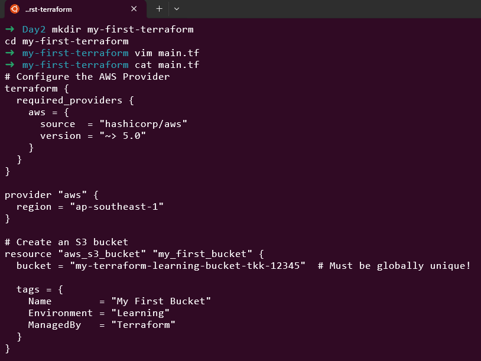
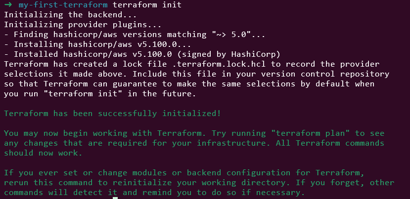
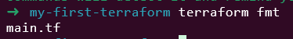
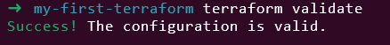
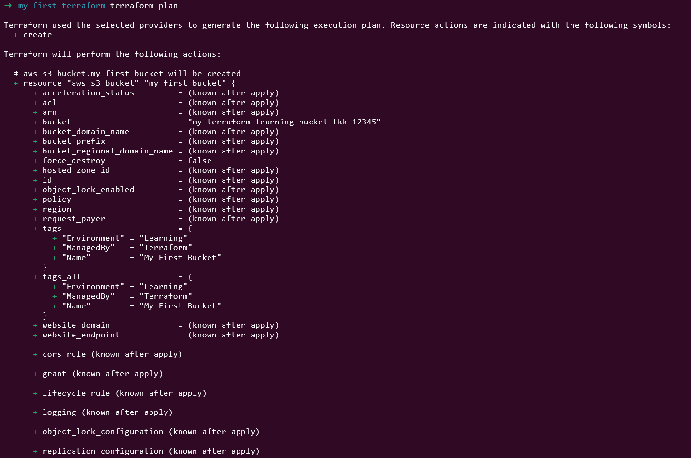
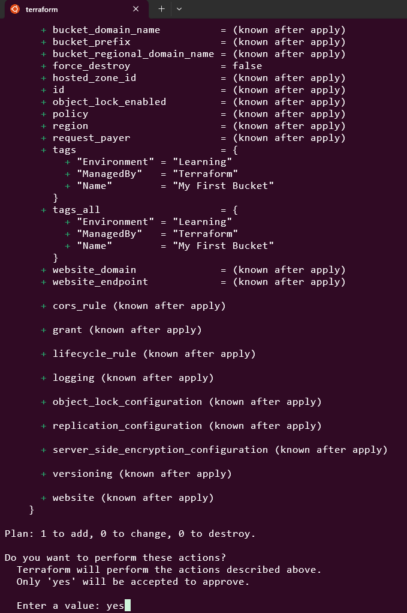
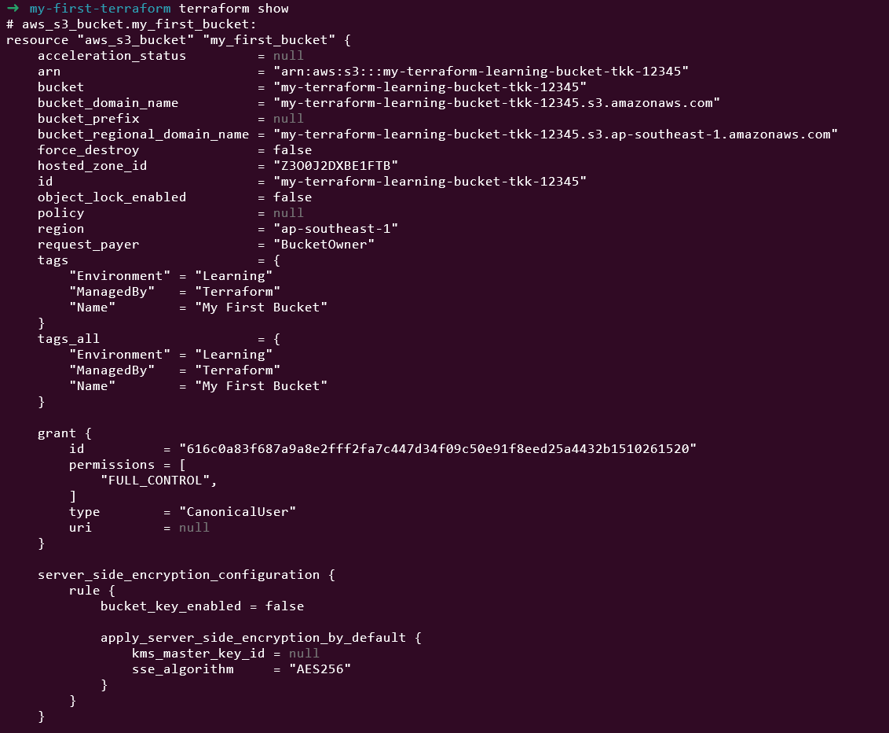
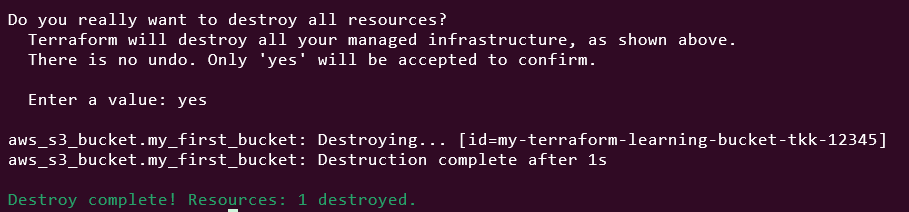

🧪 Hands-On Lab: Create Your First S3 Bucket

Let’s create infrastructure! Follow these steps carefully.
Step 1: Create a Project Directory

### Create a new directory
mkdir my-first-terraform
cd my-first-terraform

#Step 2: Create main.tf

### Create a file named main.tf with this content:

```
# Configure the AWS Provider
terraform {
  required_providers {
    aws = {
      source  = "hashicorp/aws"
      version = "~> 5.0"
    }
  }
}

provider "aws" {
  region = "us-east-1"
}

# Create an S3 bucket
resource "aws_s3_bucket" "my_first_bucket" {
  bucket = "my-terraform-learning-bucket-12345"  # Must be globally unique!

  tags = {
    Name        = "My First Bucket"
    Environment = "Learning"
    ManagedBy   = "Terraform"
  }
}
```
⚠️ Important: S3 bucket names must be globally unique across ALL AWS accounts. Change 12345 to something unique (like your name + date).



# Step 3: Initialize Terraform
```
terraform init
```

- What happens:

- Terraform downloads the AWS provider plugin

- Creates .terraform directory

- Sets up the backend

- Expected output:



# Step 4: Format Your Code
```
terraform fmt
```


This automatically formats your .tf files to follow best practices.

# Step 5: Validate Your Configuration
```
terraform validate
```

- Expected output:



# Step 6: Plan Your Changes
```
terraform plan
```



# Step 7: Apply Your Configuration
```
terraform apply
```


# Step 8: Verify in AWS Console

Log into AWS Console

Go to S3 service

You should see your bucket listed!


# Step 9: Check Terraform State
```
terraform show
```



# Step 10: Destroy Your Resources

Important: Always clean up resources to avoid charges!
```
terraform destroy
```


💡 Best Practices You Just Learned

✅ Always run terraform plan before apply

✅ Use unique, descriptive resource names

✅ Add tags to all resources for organization

✅ Destroy resources when done practicing

✅ Keep credentials secure (never in code)

🐛 Troubleshooting Common Issues

Error: “InvalidBucketName”

Bucket names must be globally unique

Use lowercase, numbers, and hyphens only

Change your bucket name and try again

Error: “No valid credential sources”

AWS credentials not configured

Run aws configure again

Verify with aws sts get-caller-identity

Error: “Unauthorized operation”

Your AWS user lacks permissions

Add AmazonS3FullAccess policy to your user

📝 Summary

Today you:
✅ Installed Terraform on your system

✅ Configured AWS CLI and credentials

✅ Learned Terraform file structure

✅ Understood HCL syntax basics

✅ Created your first infrastructure with code!

✅ Used all core Terraform commands

✅ Properly cleaned up resources

💭 Challenge Exercise

Before Day 3, try this:

Create a new directory my-second-terraform

Write a configuration to create TWO S3 buckets

Apply it, verify it in the AWS Console, then destroy it.

Hint: Just duplicate the resource block with different names!
```
resource "aws_s3_bucket" "bucket_one" {
  bucket = "my-first-practice-bucket-12345"
}

resource "aws_s3_bucket" "bucket_two" {
  bucket = "my-second-practice-bucket-12345"
}
```

Solutions
```
# Configure the AWS Provider
terraform {
  required_providers {
    aws = {
      source  = "hashicorp/aws"
      version = "~> 5.0"
    }
  }
}

provider "aws" {
}

# Create an S3 bucket
resource "aws_s3_bucket" "my_first_bucket" {
  bucket = "tkk-first-practice-bucket-12345"
}

resource "aws_s3_bucket" "bucket_two" {
  bucket = "tkk-second-practice-bucket-12345"
}
```

This lab was built using [StackOps - Diary](https://stackopsdiary.site/day-2-installing-terraform-and-your-first-configuration).