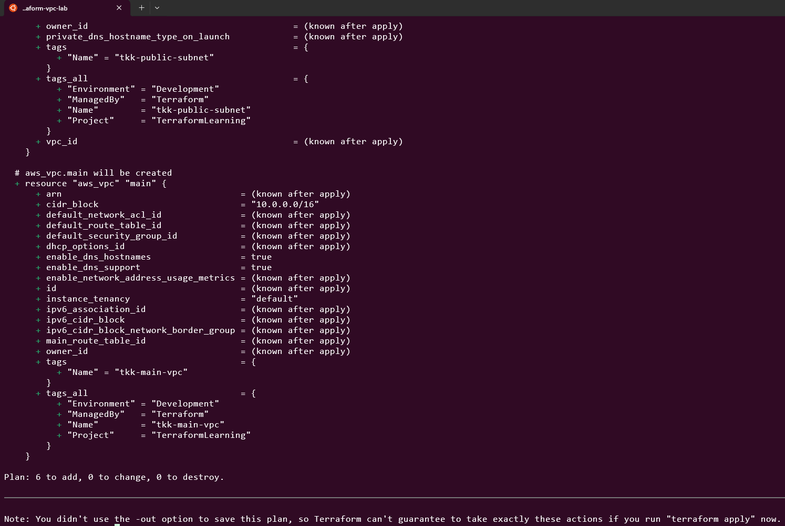

# Day 3: Understanding Providers & AWS Setup

🧪 Hands-On Lab: Build a Complete VPC Network

- Let’s build a real network infrastructure in AWS!
- What We’ll Create


### Step 1: Create Project Directory
```
mkdir terraform-vpc-lab
cd terraform-vpc-lab
```

### Step 2: Create main.tf

```
# Terraform configuration
terraform {
  required_version = ">= 1.0"

  required_providers {
    aws = {
      source  = "hashicorp/aws"
      version = "~> 5.0"
    }
  }
}

# AWS Provider configuration
provider "aws" {
  default_tags {
    tags = {
      Project     = "TerraformLearning"
      ManagedBy   = "Terraform"
      Environment = "Development"
    }
  }
}

# Create a VPC
resource "aws_vpc" "main" {
  cidr_block           = "10.0.0.0/16"
  enable_dns_hostnames = true
  enable_dns_support   = true

  tags = {
    Name = "tkk-main-vpc"
  }
}

# Create an Internet Gateway
resource "aws_internet_gateway" "main" {
  vpc_id = aws_vpc.main.id

  tags = {
    Name = "tkk-main-igw"
  }
}

# Create a Public Subnet
resource "aws_subnet" "public" {
  vpc_id                  = aws_vpc.main.id
  cidr_block              = "10.0.1.0/24"
  availability_zone       = "ap-southeast-1a"
  map_public_ip_on_launch = true

  tags = {
    Name = "tkk-public-subnet"
  }
}

# Create a Route Table
resource "aws_route_table" "public" {
  vpc_id = aws_vpc.main.id

  route {
    cidr_block = "0.0.0.0/0"
    gateway_id = aws_internet_gateway.main.id
  }

  tags = {
    Name = "tkk-public-route-table"
  }
}

# Associate Route Table with Subnet
resource "aws_route_table_association" "public" {
  subnet_id      = aws_subnet.public.id
  route_table_id = aws_route_table.public.id
}

# Create a Security Group
resource "aws_security_group" "web" {
  name        = "tkk-web-security-group"
  description = "Allow HTTP and SSH traffic"
  vpc_id      = aws_vpc.main.id

  # Allow SSH from anywhere (for learning - restrict in production!)
  ingress {
    from_port   = 22
    to_port     = 22
    protocol    = "tcp"
    cidr_blocks = ["0.0.0.0/0"]
  }

  # Allow HTTP from anywhere
  ingress {
    from_port   = 80
    to_port     = 80
    protocol    = "tcp"
    cidr_blocks = ["0.0.0.0/0"]
  }

  # Allow all outbound traffic
  egress {
    from_port   = 0
    to_port     = 0
    protocol    = "-1"
    cidr_blocks = ["0.0.0.0/0"]
  }

  tags = {
    Name = "tkk-web-sg"
  }
}
```
### Step 3: Initialize Terraform
```
terraform init
```

### Step 4: Format and Validate
```
terraform fmt
terraform validate
```

### Step 5: Plan the Deployment
```
terraform plan
```



### Step 6: Apply the Configuration
```
terraform apply
```


Step 7: Verify in AWS Console

Go to VPC Dashboard

Check:

VPCs: See “tkk-main-vpc”

Subnets: See “tkk-public-subnet”

Internet Gateways: See “tkk-main-igw”

Route Tables: See “tkk-public-route-table”

Security Groups: See “tkk-web-sg”


### Step 8: Examine Resource Dependencies
```
terraform graph
```


Step 9: Inspect Specific Resources

# Show all resources
```
terraform show
```
# Show specific resource
```
terraform state show aws_vpc.main
```


# Step 10: Understanding Resource References

Notice in our code:

vpc_id = aws_vpc.main.id

This creates an implicit dependency:

Terraform knows the subnet depends on the VPC

It creates the VPC first, then the subnet

Format: resource_type.resource_name.attribute

### Step 11: Clean Up
```
terraform destroy
```

🎓 Understanding Default Tags

Notice this in our provider block:

provider "aws" {
  region = "us-east-1"

  default_tags {
    tags = {
      Project     = "TerraformLearning"
      ManagedBy   = "Terraform"
      Environment = "Development"
    }
  }
}

Default tags are automatically applied to ALL resources:

No need to repeat in each resource

Easy to update globally

Ensures consistent tagging

Individual resource tags merge with default tags.

🔍 Useful Provider Commands
```
# Show providers used in configuration
terraform providers
# Show dependency information
terraform providers schema
# Update providers to latest allowed version
terraform init -upgrade
# Download providers without other init steps
terraform providers mirror ./providers
```

📝 Summary

Today I learned:

✅ What Terraform providers are and how they work

✅ How to configure the AWS provider

✅ Provider versioning and version constraints

✅ Provider version locking with .terraform.lock.hcl

✅ Multiple provider configurations

✅ Default tags for consistent resource tagging

✅ How to reference resources (implicit dependencies)

✅ Built a complete VPC network infrastructure


💭 Challenge Exercise

Modify today’s VPC lab to:

Add a second public subnet in ap-southeast-1b

Create a private subnet in 10.0.2.0/24

Add a security group for databases (port 3306)

Hints:

Copy the subnet resource and change values

Private subnets don’t need map_public_ip_on_launch

Use the same VPC ID for all resources

Solutions:
```
# Terraform configuration
terraform {
  required_version = ">= 1.0"

  required_providers {
    aws = {
      source  = "hashicorp/aws"
      version = "~> 5.0"
    }
  }
}

# AWS Provider configuration
provider "aws" {
  region = "ap-southeast-1"  # Added region
  
  default_tags {
    tags = {
      Project     = "TerraformLearning"
      ManagedBy   = "Terraform"
      Environment = "Development"
    }
  }
}

# Create a VPC
resource "aws_vpc" "main" {
  cidr_block           = "10.0.0.0/16"
  enable_dns_hostnames = true
  enable_dns_support   = true

  tags = {
    Name = "tkk-main-vpc"
  }
}

# Create an Internet Gateway
resource "aws_internet_gateway" "main" {
  vpc_id = aws_vpc.main.id

  tags = {
    Name = "tkk-main-igw"
  }
}

# Create Public Subnet
resource "aws_subnet" "public" {
  vpc_id                  = aws_vpc.main.id
  cidr_block              = "10.0.1.0/24"
  availability_zone       = "ap-southeast-1a"
  map_public_ip_on_launch = true

  tags = {
    Name = "tkk-public-subnet"
  }
}

# Create Private Subnet
resource "aws_subnet" "private" {
  vpc_id            = aws_vpc.main.id
  cidr_block        = "10.0.2.0/24"
  availability_zone = "ap-southeast-1b"

  tags = {
    Name = "tkk-private-subnet"
  }
}

# Create a Route Table for Public Subnet
resource "aws_route_table" "public" {
  vpc_id = aws_vpc.main.id

  route {
    cidr_block = "0.0.0.0/0"
    gateway_id = aws_internet_gateway.main.id
  }

  tags = {
    Name = "tkk-public-route-table"
  }
}

# Associate Public Route Table with Public Subnet
resource "aws_route_table_association" "public" {
  subnet_id      = aws_subnet.public.id
  route_table_id = aws_route_table.public.id
}

# Create a Route Table for Private Subnet (no internet gateway)
resource "aws_route_table" "private" {
  vpc_id = aws_vpc.main.id

  tags = {
    Name = "tkk-private-route-table"
  }
}

# Associate Private Route Table with Private Subnet
resource "aws_route_table_association" "private" {
  subnet_id      = aws_subnet.private.id
  route_table_id = aws_route_table.private.id
}

# Create a Security Group for Web Servers
resource "aws_security_group" "web" {
  name        = "tkk-web-security-group"
  description = "Allow HTTP and SSH traffic"
  vpc_id      = aws_vpc.main.id

  # Allow SSH from anywhere (for learning - restrict in production!)
  ingress {
    from_port   = 22
    to_port     = 22
    protocol    = "tcp"
    cidr_blocks = ["0.0.0.0/0"]
  }

  # Allow HTTP from anywhere
  ingress {
    from_port   = 80
    to_port     = 80
    protocol    = "tcp"
    cidr_blocks = ["0.0.0.0/0"]
  }

  # Allow all outbound traffic
  egress {
    from_port   = 0
    to_port     = 0
    protocol    = "-1"
    cidr_blocks = ["0.0.0.0/0"]
  }

  tags = {
    Name = "tkk-web-sg"
  }
}

# Create a Security Group for Databases
resource "aws_security_group" "database" {
  name        = "tkk-database-security-group"
  description = "Allow MySQL traffic from web servers"
  vpc_id      = aws_vpc.main.id

  # Allow MySQL from web security group only
  ingress {
    from_port       = 3306
    to_port         = 3306
    protocol        = "tcp"
    security_groups = [aws_security_group.web.id]  # Only allow from web SG
  }

  # Allow all outbound traffic
  egress {
    from_port   = 0
    to_port     = 0
    protocol    = "-1"
    cidr_blocks = ["0.0.0.0/0"]
  }

  tags = {
    Name = "tkk-database-sg"
  }
}
```

