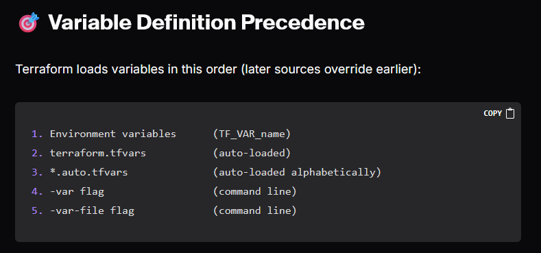
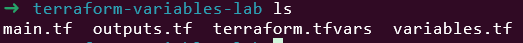
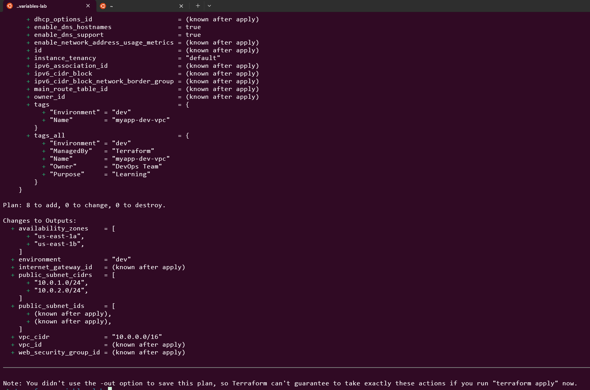
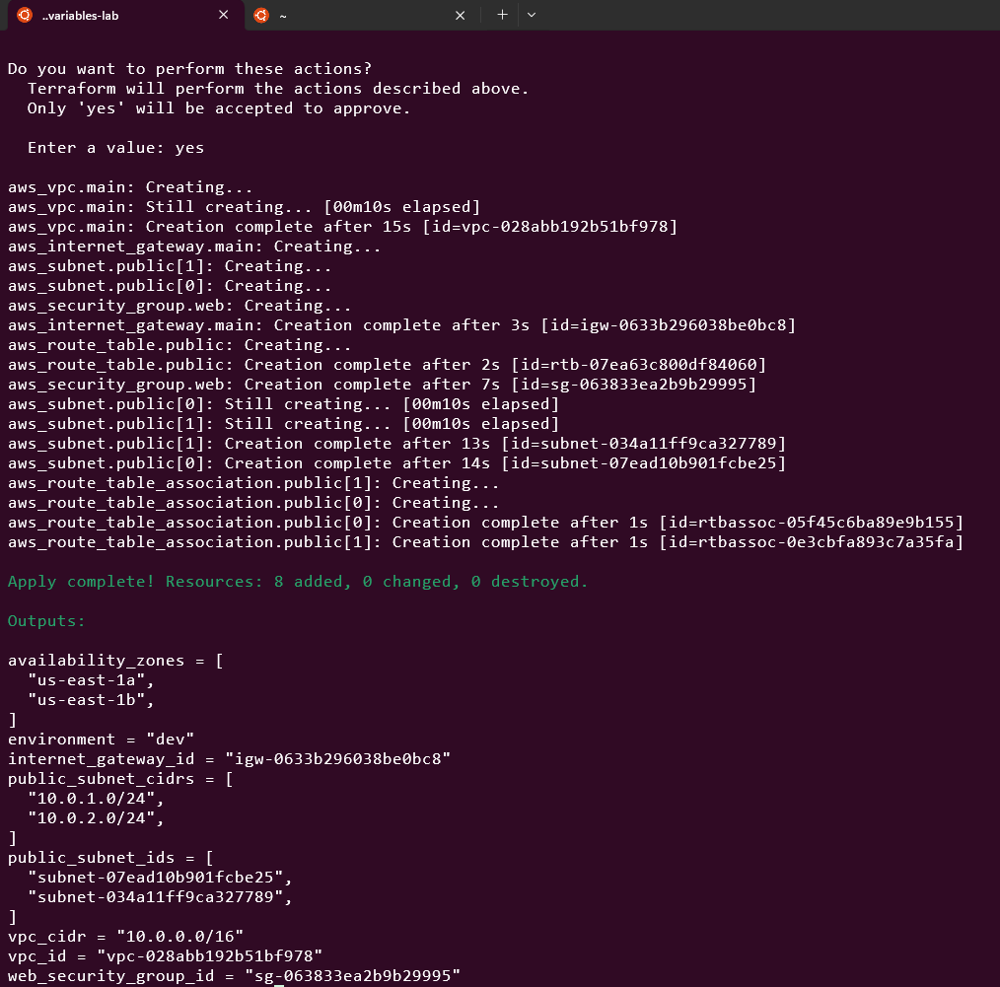
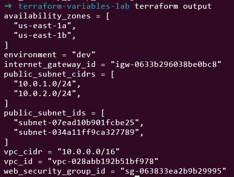
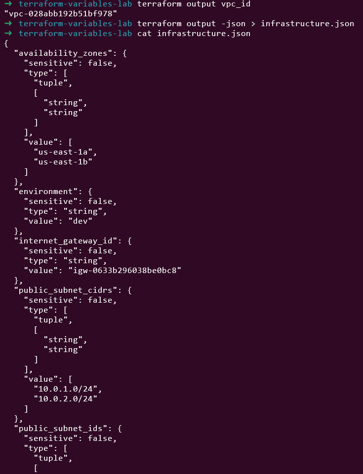
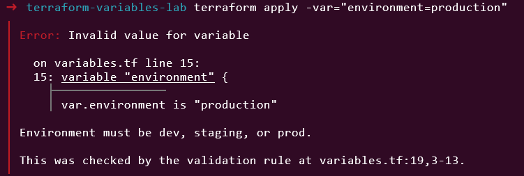
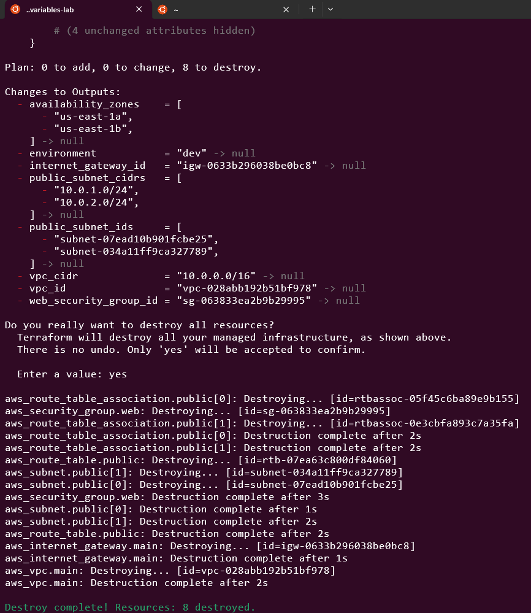
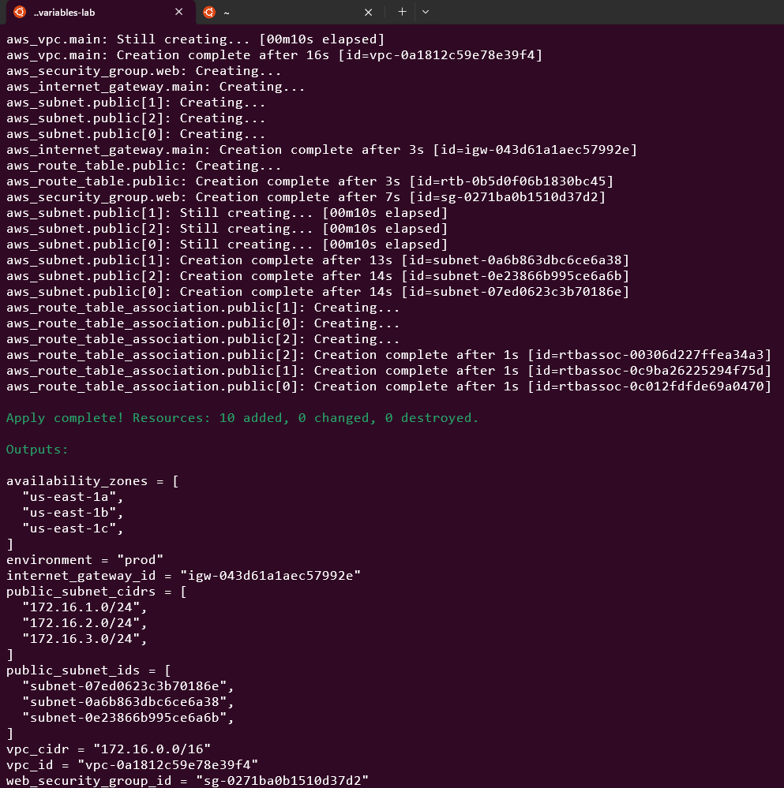

# Day 4: Terraform Basics - Variables & Outputs



🧪 Hands-On Lab: Parameterized VPC Infrastructure

Let’s rebuild our VPC with variables and outputs!

### Step 1: Create Project Structure 

```
mkdir terraform-variables-lab
cd terraform-variables-lab
```


Create these files:

variables.tf - Variable definitions

main.tf - Resources

outputs.tf - Output values

terraform.tfvars - Variable values


### Step 2: Create variables.tf

```
# variables.tf

variable "aws_region" {
  description = "AWS region for resources"
  type        = string
  default     = "us-east-1"
}

variable "project_name" {
  description = "Project name for tagging"
  type        = string
  default     = "terraform-learning"
}

variable "environment" {
  description = "Environment (dev, staging, prod)"
  type        = string

  validation {
    condition     = contains(["dev", "staging", "prod"], var.environment)
    error_message = "Environment must be dev, staging, or prod."
  }
}

variable "vpc_cidr" {
  description = "CIDR block for VPC"
  type        = string
  default     = "10.0.0.0/16"
}

variable "public_subnet_cidrs" {
  description = "CIDR blocks for public subnets"
  type        = list(string)
  default     = ["10.0.1.0/24", "10.0.2.0/24"]
}

variable "availability_zones" {
  description = "Availability zones"
  type        = list(string)
  default     = ["us-east-1a", "us-east-1b"]
}

variable "enable_dns_hostnames" {
  description = "Enable DNS hostnames in VPC"
  type        = bool
  default     = true
}

variable "common_tags" {
  description = "Common tags for all resources"
  type        = map(string)
  default = {
    ManagedBy = "Terraform"
  }
}
```

### Step 3: Create main.tf
```
# main.tf

terraform {
  required_version = ">= 1.0"

  required_providers {
    aws = {
      source  = "hashicorp/aws"
      version = "~> 5.0"
    }
  }
}

provider "aws" {
  region = var.aws_region

  default_tags {
    tags = var.common_tags
  }
}

# VPC
resource "aws_vpc" "main" {
  cidr_block           = var.vpc_cidr
  enable_dns_hostnames = var.enable_dns_hostnames
  enable_dns_support   = true

  tags = {
    Name        = "${var.project_name}-${var.environment}-vpc"
    Environment = var.environment
  }
}

# Internet Gateway
resource "aws_internet_gateway" "main" {
  vpc_id = aws_vpc.main.id

  tags = {
    Name        = "${var.project_name}-${var.environment}-igw"
    Environment = var.environment
  }
}

# Public Subnets
resource "aws_subnet" "public" {
  count = length(var.public_subnet_cidrs)

  vpc_id                  = aws_vpc.main.id
  cidr_block              = var.public_subnet_cidrs[count.index]
  availability_zone       = var.availability_zones[count.index]
  map_public_ip_on_launch = true

  tags = {
    Name        = "${var.project_name}-${var.environment}-public-subnet-${count.index + 1}"
    Environment = var.environment
    Type        = "Public"
  }
}

# Route Table
resource "aws_route_table" "public" {
  vpc_id = aws_vpc.main.id

  route {
    cidr_block = "0.0.0.0/0"
    gateway_id = aws_internet_gateway.main.id
  }

  tags = {
    Name        = "${var.project_name}-${var.environment}-public-rt"
    Environment = var.environment
  }
}

# Route Table Associations
resource "aws_route_table_association" "public" {
  count = length(var.public_subnet_cidrs)

  subnet_id      = aws_subnet.public[count.index].id
  route_table_id = aws_route_table.public.id
}

# Security Group
resource "aws_security_group" "web" {
  name        = "${var.project_name}-${var.environment}-web-sg"
  description = "Security group for web servers"
  vpc_id      = aws_vpc.main.id

  ingress {
    description = "HTTP from anywhere"
    from_port   = 80
    to_port     = 80
    protocol    = "tcp"
    cidr_blocks = ["0.0.0.0/0"]
  }

  ingress {
    description = "HTTPS from anywhere"
    from_port   = 443
    to_port     = 443
    protocol    = "tcp"
    cidr_blocks = ["0.0.0.0/0"]
  }

  egress {
    description = "All traffic outbound"
    from_port   = 0
    to_port     = 0
    protocol    = "-1"
    cidr_blocks = ["0.0.0.0/0"]
  }

  tags = {
    Name        = "${var.project_name}-${var.environment}-web-sg"
    Environment = var.environment
  }
}
```

### Step 4: Create outputs.tf
```
# outputs.tf

output "vpc_id" {
  description = "ID of the VPC"
  value       = aws_vpc.main.id
}

output "vpc_cidr" {
  description = "CIDR block of the VPC"
  value       = aws_vpc.main.cidr_block
}

output "public_subnet_ids" {
  description = "IDs of public subnets"
  value       = aws_subnet.public[*].id
}

output "public_subnet_cidrs" {
  description = "CIDR blocks of public subnets"
  value       = aws_subnet.public[*].cidr_block
}

output "internet_gateway_id" {
  description = "ID of the Internet Gateway"
  value       = aws_internet_gateway.main.id
}

output "web_security_group_id" {
  description = "ID of the web security group"
  value       = aws_security_group.web.id
}

output "availability_zones" {
  description = "Availability zones used"
  value       = aws_subnet.public[*].availability_zone
}

output "environment" {
  description = "Environment name"
  value       = var.environment
}
```
### Step 5: Create terraform.tfvars
```
# terraform.tfvars

environment          = "dev"
project_name         = "myapp"
vpc_cidr             = "10.0.0.0/16"
public_subnet_cidrs  = ["10.0.1.0/24", "10.0.2.0/24"]
availability_zones   = ["us-east-1a", "us-east-1b"]
enable_dns_hostnames = true

common_tags = {
  ManagedBy = "Terraform"
  Owner     = "DevOps Team"
  Purpose   = "Learning"
}
```


### Step 6: Initialize and Validate
```
terraform init
terraform fmt
terraform validate
```

### Step 7: Plan with Different Environments

Development:
```
terraform plan
```



Staging (create staging.tfvars):

# staging.tfvars
environment = "staging"
vpc_cidr    = "10.1.0.0/16"
public_subnet_cidrs = ["10.1.1.0/24", "10.1.2.0/24"]

```
terraform plan -var-file="staging.tfvars"
```

Step 8: Apply Configuration
```
terraform apply
```



### Step 9: View Outputs
```
# All outputs
terraform output
# Specific output
terraform output vpc_id
# JSON format
terraform output -json > infrastructure.json
```





### Step 10: Test Variable Validation

Try an invalid environment:
```
terraform apply -var="environment=production"
```



### Step 11: Clean Up
```
terraform destroy
```



📝 Summary

Today I learned:

✅ Input variables and their importance

✅ All variable types (string, number, bool, list, map, object)

✅ Variable definition precedence

✅ Multiple ways to set variable values

✅ Variable validation

✅ Output values and their uses

✅ Built parameterized, reusable infrastructure

💭 Challenge Exercise

Create a production.tfvars file that:

Uses a different VPC CIDR (172.16.0.0/16)

Creates 3 subnets instead of 2

Sets environment to “prod”

Adds a custom tag “CostCenter = Production”

# production.tfvars
environment = "prod"
vpc_cidr    = "172.16.0.0/16"
public_subnet_cidrs = ["172.16.1.0/24", "172.16.2.0/24", "172.16.3.0/24"]
project_name         = "myapp"
availability_zones   = ["us-east-1a", "us-east-1b", "us-east-1c"]
enable_dns_hostnames = true

common_tags = {
  ManagedBy = "Terraform"
  Owner     = "DevOps Team"
  Purpose   = "Learning"
  CostCenter  = "Production"
}

Then apply it:
```
terraform apply -var-file="production.tfvars"
```



This lab was built using [StackOps - Diary](https://stackopsdiary.site/day-4-terraform-basics-variables-and-outputs).