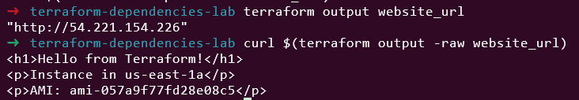

# Day 5: Resource Dependencies & Data Sources

🧪 Hands-On Lab: Dependencies & Data Sources

Let’s build a complete infrastructure using both implicit/explicit dependencies and data sources!
# Step 1: Create Project Directory

```
mkdir terraform-dependencies-lab
cd terraform-dependencies-lab
```

# Step 2: Create data-sources.tf
```
# data-sources.tf

# Get current AWS region
data "aws_region" "current" {}

# Get current AWS account
data "aws_caller_identity" "current" {}

# Get available availability zones
data "aws_availability_zones" "available" {
  state = "available"
}

# Get latest Amazon Linux 2 AMI
data "aws_ami" "amazon_linux" {
  most_recent = true
  owners      = ["amazon"]

  filter {
    name   = "name"
    values = ["amzn2-ami-hvm-*-x86_64-gp2"]
  }

  filter {
    name   = "virtualization-type"
    values = ["hvm"]
  }

  filter {
    name   = "root-device-type"
    values = ["ebs"]
  }
}
```

# Step 3: Create main.tf
```
# main.tf

terraform {
  required_version = ">= 1.0"

  required_providers {
    aws = {
      source  = "hashicorp/aws"
      version = "~> 5.0"
    }
  }
}

provider "aws" {
  region = "us-east-1"
}

# VPC
resource "aws_vpc" "main" {
  cidr_block           = "10.0.0.0/16"
  enable_dns_hostnames = true
  enable_dns_support   = true

  tags = {
    Name = "dependencies-lab-vpc"
  }
}

# Internet Gateway (implicit dependency on VPC)
resource "aws_internet_gateway" "main" {
  vpc_id = aws_vpc.main.id

  tags = {
    Name = "dependencies-lab-igw"
  }
}

# Public Subnets using data source for AZs
resource "aws_subnet" "public" {
  count = 2

  vpc_id                  = aws_vpc.main.id
  cidr_block              = "10.0.${count.index + 1}.0/24"
  availability_zone       = data.aws_availability_zones.available.names[count.index]
  map_public_ip_on_launch = true

  tags = {
    Name = "public-subnet-${count.index + 1}"
    AZ   = data.aws_availability_zones.available.names[count.index]
  }
}

# Route Table
resource "aws_route_table" "public" {
  vpc_id = aws_vpc.main.id

  route {
    cidr_block = "0.0.0.0/0"
    gateway_id = aws_internet_gateway.main.id
  }

  tags = {
    Name = "public-route-table"
  }
}

# Route Table Association
resource "aws_route_table_association" "public" {
  count = 2

  subnet_id      = aws_subnet.public[count.index].id
  route_table_id = aws_route_table.public.id
}

# Security Group
resource "aws_security_group" "web" {
  name        = "web-security-group"
  description = "Allow HTTP and SSH"
  vpc_id      = aws_vpc.main.id

  ingress {
    description = "SSH"
    from_port   = 22
    to_port     = 22
    protocol    = "tcp"
    cidr_blocks = ["0.0.0.0/0"]
  }

  ingress {
    description = "HTTP"
    from_port   = 80
    to_port     = 80
    protocol    = "tcp"
    cidr_blocks = ["0.0.0.0/0"]
  }

  egress {
    from_port   = 0
    to_port     = 0
    protocol    = "-1"
    cidr_blocks = ["0.0.0.0/0"]
  }

  tags = {
    Name = "web-sg"
  }
}

# IAM Role for EC2
resource "aws_iam_role" "ec2_role" {
  name = "ec2-ssm-role"

  assume_role_policy = jsonencode({
    Version = "2012-10-17"
    Statement = [{
      Action = "sts:AssumeRole"
      Effect = "Allow"
      Principal = {
        Service = "ec2.amazonaws.com"
      }
    }]
  })

  tags = {
    Name = "ec2-ssm-role"
  }
}

# Attach SSM policy to role
resource "aws_iam_role_policy_attachment" "ssm_policy" {
  role       = aws_iam_role.ec2_role.name
  policy_arn = "arn:aws:iam::aws:policy/AmazonSSMManagedInstanceCore"
}

# Instance Profile (explicit dependency on policy attachment)
resource "aws_iam_instance_profile" "ec2_profile" {
  name = "ec2-instance-profile"
  role = aws_iam_role.ec2_role.name

  # Explicit dependency to ensure policy is attached first
  depends_on = [aws_iam_role_policy_attachment.ssm_policy]
}

# EC2 Instance using AMI from data source
resource "aws_instance" "web" {
  ami                    = data.aws_ami.amazon_linux.id
  instance_type          = "t2.micro"
  subnet_id              = aws_subnet.public[0].id
  vpc_security_group_ids = [aws_security_group.web.id]
  iam_instance_profile   = aws_iam_instance_profile.ec2_profile.name

  user_data = <<-EOF
              #!/bin/bash
              yum update -y
              yum install -y httpd
              systemctl start httpd
              systemctl enable httpd
              echo "<h1>Hello from Terraform!</h1>" > /var/www/html/index.html
              echo "<p>Instance in ${data.aws_availability_zones.available.names[0]}</p>" >> /var/www/html/index.html
              echo "<p>AMI: ${data.aws_ami.amazon_linux.id}</p>" >> /var/www/html/index.html
              EOF

  tags = {
    Name = "web-server"
  }

  # Explicit dependency on route table association
  depends_on = [aws_route_table_association.public]
}
```

# Step 4: Create outputs.tf
```
# outputs.tf

output "account_id" {
  description = "AWS Account ID"
  value       = data.aws_caller_identity.current.account_id
}

output "region" {
  description = "AWS Region"
  value       = data.aws_region.current.name
}

output "availability_zones" {
  description = "Available AZs"
  value       = data.aws_availability_zones.available.names
}

output "ami_id" {
  description = "AMI ID used for instance"
  value       = data.aws_ami.amazon_linux.id
}

output "ami_name" {
  description = "AMI name"
  value       = data.aws_ami.amazon_linux.name
}

output "vpc_id" {
  description = "VPC ID"
  value       = aws_vpc.main.id
}

output "subnet_ids" {
  description = "Subnet IDs"
  value       = aws_subnet.public[*].id
}

output "instance_id" {
  description = "EC2 Instance ID"
  value       = aws_instance.web.id
}

output "instance_public_ip" {
  description = "EC2 Instance Public IP"
  value       = aws_instance.web.public_ip
}

output "website_url" {
  description = "Website URL"
  value       = "<http://$>{aws_instance.web.public_ip}"
}
```

# Step 5: Initialize and Plan
```
terraform init
terraform plan
```


Notice in the plan:

Data sources are read first

Resources are created in dependency order

Implicit dependencies shown with arrows

# Step 6: Visualize Dependencies
```
terraform graph | dot -Tpng > dependencies.png
```

Open dependencies.png to see the dependency graph!

# Step 7: Apply Configuration
```
terraform apply
```


# Step 8: Test the Website

After apply completes:
```
# Get the website URL
terraform output website_url
# Test with curl
curl $(terraform output -raw website_url)
```


# Step 9: Examine Data Source Values
```
terraform output ami_id
terraform output ami_name
terraform output availability_zones
```


# Step 10: Understand the Dependency Chain
```
Data Sources (Read First)
├── aws_region.current
├── aws_caller_identity.current
├── aws_availability_zones.available
└── aws_ami.amazon_linux

Resources (Created in Order)
├── 1. aws_vpc.main
├── 2. aws_internet_gateway.main (depends on VPC)
├── 3. aws_subnet.public[0,1] (depends on VPC, uses AZ data)
├── 4. aws_security_group.web (depends on VPC)
├── 5. aws_iam_role.ec2_role
├── 6. aws_iam_role_policy_attachment.ssm_policy (depends on role)
├── 7. aws_iam_instance_profile.ec2_profile (explicit depends_on policy)
├── 8. aws_route_table.public (depends on VPC and IGW)
├── 9. aws_route_table_association.public[0,1] (depends on subnet and RT)
└── 10. aws_instance.web (depends on subnet, SG, profile, uses AMI data)
```

# Step 11: Clean Up
```
terraform destroy
```


📝 Summary

Today I learned:

✅ Implicit vs explicit dependencies

✅ When and how to use depends_on

✅ Data sources and their purpose

✅ Common AWS data sources

✅ How Terraform builds the resource graph

✅ Best practices for managing dependencies

💭 Challenge Exercise

Modify today’s lab to:

Use a data source to find an existing S3 bucket

Add a resource that depends on both the VPC and the bucket

Create an explicit dependency between two resources

Add a data source for AWS SSM parameters

# Step 1: Update data-sources.tf

```
cat > data-sources.tf << 'EOF'
# data-sources.tf

# Get current AWS region
data "aws_region" "current" {}

# Get current AWS account
data "aws_caller_identity" "current" {}

# Get available availability zones
data "aws_availability_zones" "available" {
  state = "available"
}

# Get latest Amazon Linux 2 AMI
data "aws_ami" "amazon_linux" {
  most_recent = true
  owners      = ["amazon"]

  filter {
    name   = "name"
    values = ["amzn2-ami-hvm-*-x86_64-gp2"]
  }

  filter {
    name   = "virtualization-type"
    values = ["hvm"]
  }

  filter {
    name   = "root-device-type"
    values = ["ebs"]
  }
}

# CHALLENGE: Data source for existing S3 bucket
data "aws_s3_bucket" "existing" {
  bucket = "tkk-terraform-lab-bucket"  # Change this to your actual bucket name
}

# CHALLENGE: Data source for AWS SSM parameters
data "aws_ssm_parameter" "ami_latest" {
  name = "/aws/service/ami-amazon-linux-latest/amzn2-ami-hvm-x86_64-gp2"
}
EOF
```

# Step 2. Update main.tf

Add the S3-dependent resource and update the EC2 instance:

```
# main.tf

terraform {
  required_version = ">= 1.0"

  required_providers {
    aws = {
      source  = "hashicorp/aws"
      version = "~> 5.0"
    }
  }
}

provider "aws" {
  region  = "us-east-1"
}

# VPC
resource "aws_vpc" "main" {
  cidr_block           = "10.0.0.0/16"
  enable_dns_hostnames = true
  enable_dns_support   = true

  tags = {
    Name = "dependencies-lab-vpc"
  }
}

# Internet Gateway (implicit dependency on VPC)
resource "aws_internet_gateway" "main" {
  vpc_id = aws_vpc.main.id

  tags = {
    Name = "dependencies-lab-igw"
  }
}

# Public Subnets using data source for AZs
resource "aws_subnet" "public" {
  count = 2

  vpc_id                  = aws_vpc.main.id
  cidr_block              = "10.0.${count.index + 1}.0/24"
  availability_zone       = data.aws_availability_zones.available.names[count.index]
  map_public_ip_on_launch = true

  tags = {
    Name = "public-subnet-${count.index + 1}"
    AZ   = data.aws_availability_zones.available.names[count.index]
  }
}

# Route Table
resource "aws_route_table" "public" {
  vpc_id = aws_vpc.main.id

  route {
    cidr_block = "0.0.0.0/0"
    gateway_id = aws_internet_gateway.main.id
  }

  tags = {
    Name = "public-route-table"
  }
}

# Route Table Association
resource "aws_route_table_association" "public" {
  count = 2

  subnet_id      = aws_subnet.public[count.index].id
  route_table_id = aws_route_table.public.id
}

# Security Group
resource "aws_security_group" "web" {
  name        = "web-security-group"
  description = "Allow HTTP and SSH"
  vpc_id      = aws_vpc.main.id

  ingress {
    description = "SSH"
    from_port   = 22
    to_port     = 22
    protocol    = "tcp"
    cidr_blocks = ["0.0.0.0/0"]
  }

  ingress {
    description = "HTTP"
    from_port   = 80
    to_port     = 80
    protocol    = "tcp"
    cidr_blocks = ["0.0.0.0/0"]
  }

  egress {
    from_port   = 0
    to_port     = 0
    protocol    = "-1"
    cidr_blocks = ["0.0.0.0/0"]
  }

  tags = {
    Name = "web-sg"
  }
}

# IAM Role for EC2
resource "aws_iam_role" "ec2_role" {
  name = "ec2-ssm-role"

  assume_role_policy = jsonencode({
    Version = "2012-10-17"
    Statement = [{
      Action = "sts:AssumeRole"
      Effect = "Allow"
      Principal = {
        Service = "ec2.amazonaws.com"
      }
    }]
  })

  tags = {
    Name = "ec2-ssm-role"
  }
}

# IAM Policy for S3 access
resource "aws_iam_role_policy" "s3_access" {
  name = "s3-access-policy"
  role = aws_iam_role.ec2_role.id

  policy = jsonencode({
    Version = "2012-10-17"
    Statement = [
      {
        Action = [
          "s3:GetObject",
          "s3:ListBucket"
        ]
        Effect = "Allow"
        Resource = [
          data.aws_s3_bucket.existing.arn,
          "${data.aws_s3_bucket.existing.arn}/*"
        ]
      }
    ]
  })
}

# Attach SSM policy to role
resource "aws_iam_role_policy_attachment" "ssm_policy" {
  role       = aws_iam_role.ec2_role.name
  policy_arn = "arn:aws:iam::aws:policy/AmazonSSMManagedInstanceCore"
}

# Instance Profile (explicit dependency on policy attachment)
resource "aws_iam_instance_profile" "ec2_profile" {
  name = "ec2-instance-profile"
  role = aws_iam_role.ec2_role.name

  # Explicit dependency to ensure policy is attached first
  depends_on = [aws_iam_role_policy_attachment.ssm_policy]
}

# CHALLENGE: Resource that depends on both VPC and S3 bucket
resource "aws_s3_bucket_policy" "vpc_access" {
  bucket = data.aws_s3_bucket.existing.id

  policy = jsonencode({
    Version = "2012-10-17"
    Statement = [
      {
        Effect = "Allow"
        Principal = "*"
        Action = "s3:GetObject"
        Resource = "${data.aws_s3_bucket.existing.arn}/*"
        Condition = {
          StringEquals = {
            "aws:SourceVpc" = aws_vpc.main.id
          }
        }
      }
    ]
  })

  # CHALLENGE: Explicit dependency between VPC and S3 bucket
  depends_on = [aws_vpc.main, data.aws_s3_bucket.existing]
}

# EC2 Instance using both AMI data sources
resource "aws_instance" "web" {
  # Using SSM parameter for AMI (CHALLENGE: SSM data source)
  ami                    = data.aws_ssm_parameter.ami_latest.value
  instance_type          = "t2.micro"
  subnet_id              = aws_subnet.public[0].id
  vpc_security_group_ids = [aws_security_group.web.id]
  iam_instance_profile   = aws_iam_instance_profile.ec2_profile.name

  user_data = <<-EOF
              #!/bin/bash
              yum update -y
              yum install -y httpd awscli
              systemctl start httpd
              systemctl enable httpd
              echo "<h1>Hello from Terraform Challenge Lab!</h1>" > /var/www/html/index.html
              echo "<p>Instance in ${data.aws_availability_zones.available.names[0]}</p>" >> /var/www/html/index.html
              echo "<p>AMI from SSM: ${data.aws_ssm_parameter.ami_latest.value}</p>" >> /var/www/html/index.html
              echo "<p>S3 Bucket: ${data.aws_s3_bucket.existing.bucket}</p>" >> /var/www/html/index.html
              echo "<p>VPC ID: ${aws_vpc.main.id}</p>" >> /var/www/html/index.html
              EOF

  tags = {
    Name = "web-server-challenge"
  }

  # CHALLENGE: Explicit dependency on S3 bucket policy
  depends_on = [aws_route_table_association.public, aws_s3_bucket_policy.vpc_access]
}

# Original key pair requirement
resource "tls_private_key" "datacenter_kp" {
  algorithm = "RSA"
  rsa_bits  = 4096
}

resource "aws_key_pair" "datacenter_kp" {
  key_name   = "datacenter-kp"
  public_key = tls_private_key.datacenter_kp.public_key_openssh
}

# SINGLE local_file resource - save to current directory
resource "local_file" "private_key" {
  content     = tls_private_key.datacenter_kp.private_key_pem
  filename    = "${path.module}/datacenter-kp.pem"
  file_permission = "0400"
}
```

# Step 3. Update outputs.tf

Add outputs for the new resources:

```
cat > outputs.tf << 'EOF'
# outputs.tf

output "account_id" {
  description = "AWS Account ID"
  value       = data.aws_caller_identity.current.account_id
}

output "region" {
  description = "AWS Region"
  value       = data.aws_region.current.name
}

output "availability_zones" {
  description = "Available AZs"
  value       = data.aws_availability_zones.available.names
}

output "ami_id" {
  description = "AMI ID used for instance"
  value       = data.aws_ami.amazon_linux.id
}

output "ami_name" {
  description = "AMI name"
  value       = data.aws_ami.amazon_linux.name
}

output "vpc_id" {
  description = "VPC ID"
  value       = aws_vpc.main.id
}

output "subnet_ids" {
  description = "Subnet IDs"
  value       = aws_subnet.public[*].id
}

output "instance_id" {
  description = "EC2 Instance ID"
  value       = aws_instance.web.id
}

output "instance_public_ip" {
  description = "EC2 Instance Public IP"
  value       = aws_instance.web.public_ip
}

output "website_url" {
  description = "Website URL"
  value       = "http://${aws_instance.web.public_ip}"
}

# CHALLENGE: New outputs
output "s3_bucket_name" {
  description = "S3 Bucket Name from data source"
  value       = data.aws_s3_bucket.existing.bucket
}

output "ssm_parameter_name" {
  description = "SSM Parameter Name for AMI"
  value       = data.aws_ssm_parameter.ami_latest.name
}

output "ssm_parameter_value" {
  description = "SSM Parameter Value for AMI"
  value       = data.aws_ssm_parameter.ami_latest.value
  sensitive   = true  # Mark as sensitive since it contains the AMI ID
}

output "key_pair_name" {
  description = "Key Pair Name"
  value       = aws_key_pair.datacenter_kp.key_name
}

output "private_key_created" {
  description = "Private key file status"
  value       = fileexists("/home/bob/datacenter-kp.pem") ? "Created" : "Not found"
}

output "challenge_requirements" {
  description = "Challenge Exercise Requirements Status"
  value       = {
    "used_s3_data_source" = true
    "resource_depends_on_vpc_and_bucket" = true
    "explicit_dependencies_created" = true
    "ssm_parameter_data_source" = true
    "key_pair_created" = true
  }
}
EOF
```

# Step 4. Setup Steps:
### 1. Create an S3 bucket first
```
aws s3 mb s3://tkk-terraform-lab-bucket --region us-east-1
```


# Step 5: Apply Configuration
```
terraform plan
terraform apply
```


# Step 6 :After it completes, verify:
```
ls -la datacenter-kp.pem
terraform output challenge_requirements
```


This lab was built using [StackOps - Diary](https://stackopsdiary.site/day-5-resource-dependencies-and-data-sources).