# Day 6: State Management Fundamentals

🧪 Hands-On Lab: Remote State with S3

Let’s set up remote state storage with S3 and DynamoDB!
# Step 1: Create State Backend Infrastructure

First, we need to create S3 bucket and DynamoDB table. Create a new directory:

```
mkdir terraform-state-backend
cd terraform-state-backend
```

Create backend-setup.tf:
```
# backend-setup.tf

terraform {
  required_version = ">= 1.0"

  required_providers {
    aws = {
      source  = "hashicorp/aws"
      version = "~> 5.0"
    }
  }
}

provider "aws" {
  region = "us-east-1"
}

# Random suffix for unique bucket name
resource "random_id" "bucket_suffix" {
  byte_length = 4
}

# S3 Bucket for Terraform State
resource "aws_s3_bucket" "terraform_state" {
  bucket = "terraform-state-${random_id.bucket_suffix.hex}"

  tags = {
    Name        = "Terraform State Bucket"
    Environment = "Learning"
  }
}

# Enable versioning
resource "aws_s3_bucket_versioning" "terraform_state" {
  bucket = aws_s3_bucket.terraform_state.id

  versioning_configuration {
    status = "Enabled"
  }
}

# Enable encryption
resource "aws_s3_bucket_server_side_encryption_configuration" "terraform_state" {
  bucket = aws_s3_bucket.terraform_state.id

  rule {
    apply_server_side_encryption_by_default {
      sse_algorithm = "AES256"
    }
  }
}

# Block public access
resource "aws_s3_bucket_public_access_block" "terraform_state" {
  bucket = aws_s3_bucket.terraform_state.id

  block_public_acls       = true
  block_public_policy     = true
  ignore_public_acls      = true
  restrict_public_buckets = true
}

# DynamoDB Table for State Locking
resource "aws_dynamodb_table" "terraform_locks" {
  name         = "terraform-state-lock"
  billing_mode = "PAY_PER_REQUEST"
  hash_key     = "LockID"

  attribute {
    name = "LockID"
    type = "S"
  }

  tags = {
    Name        = "Terraform State Lock Table"
    Environment = "Learning"
  }
}

# Outputs
output "s3_bucket_name" {
  description = "S3 bucket name for state"
  value       = aws_s3_bucket.terraform_state.id
}

output "dynamodb_table_name" {
  description = "DynamoDB table name for locking"
  value       = aws_dynamodb_table.terraform_locks.name
}

output "backend_config" {
  description = "Backend configuration to use"
  value = <<-EOT
    terraform {
      backend "s3" {
        bucket         = "${aws_s3_bucket.terraform_state.id}"
        key            = "project/terraform.tfstate"
        region         = "us-east-1"
        encrypt        = true
        dynamodb_table = "${aws_dynamodb_table.terraform_locks.name}"
      }
    }
  EOT
}
```


# Step 2: Create Backend Infrastructure
```
terraform init
terraform apply
```

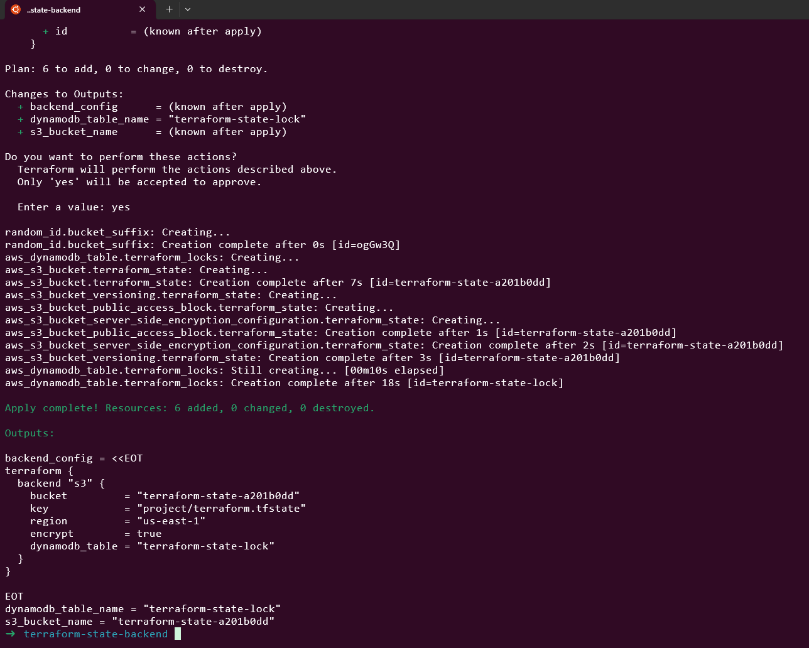

# Save bucket name
```
terraform output -raw s3_bucket_name > ../bucket_name.txt
```

# View the backend config
```
terraform output backend_config
```

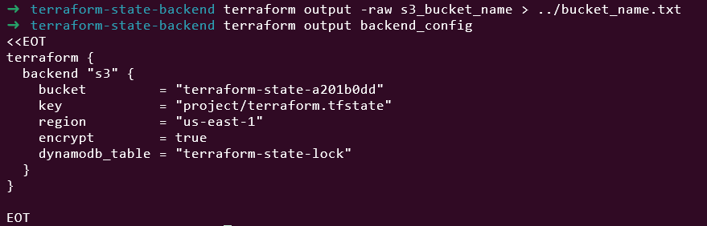

# Step 3: Create a Project with Remote State

Create a new directory:
```
cd ..
mkdir terraform-remote-state-demo
cd terraform-remote-state-demo
```

# Step 4: Configure Remote Backend

Create backend.tf:
```
# backend.tf

terraform {
  backend "s3" {
    bucket         = "terraform-state-XXXX"  # Replace with your bucket name
    key            = "demo/terraform.tfstate"
    region         = "us-east-1"
    encrypt        = true
    dynamodb_table = "terraform-state-lock"
  }
}
```

Replace terraform-state-XXXX with your actual bucket name from step 2!


# Step 5: Create Resources

Create main.tf:
```
# main.tf

terraform {
  required_providers {
    aws = {
      source  = "hashicorp/aws"
      version = "~> 5.0"
    }
  }
}

provider "aws" {
  region = "us-east-1"
}

# VPC
resource "aws_vpc" "main" {
  cidr_block = "10.0.0.0/16"

  tags = {
    Name = "remote-state-demo-vpc"
  }
}

# Subnet
resource "aws_subnet" "public" {
  vpc_id     = aws_vpc.main.id
  cidr_block = "10.0.1.0/24"

  tags = {
    Name = "remote-state-demo-subnet"
  }
}

# Security Group
resource "aws_security_group" "web" {
  name        = "remote-state-demo-sg"
  description = "Demo security group"
  vpc_id      = aws_vpc.main.id

  ingress {
    from_port   = 80
    to_port     = 80
    protocol    = "tcp"
    cidr_blocks = ["0.0.0.0/0"]
  }

  egress {
    from_port   = 0
    to_port     = 0
    protocol    = "-1"
    cidr_blocks = ["0.0.0.0/0"]
  }

  tags = {
    Name = "remote-state-demo-sg"
  }
}
```

Create outputs.tf:
```
# outputs.tf

output "vpc_id" {
  description = "VPC ID"
  value       = aws_vpc.main.id
}

output "subnet_id" {
  description = "Subnet ID"
  value       = aws_subnet.public.id
}

output "security_group_id" {
  description = "Security Group ID"
  value       = aws_security_group.web.id
}
```

# Step 6: Initialize with Remote Backend
```
terraform init
```

# Step 7: Apply Configuration
```
terraform apply
```

# Step 8: Verify State in S3

# List state files in S3
```
aws s3 ls s3://terraform-state-a201b0dd/demo/
```

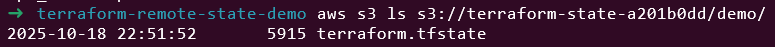

# Download and view state
```
aws s3 cp s3://terraform-state-a201b0dd/demo/terraform.tfstate - | jq '.'
```

# Step 9: Test State Locking

Terminal 1:
```
terraform plan
```
# Keep this running

Terminal 2 (while Terminal 1 is still running):
```
terraform plan
```

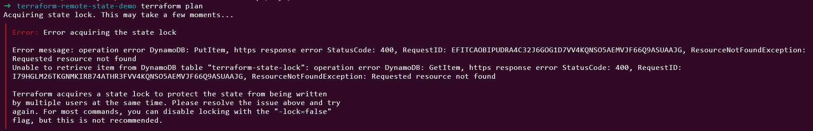

# Step 10: Verify State in DynamoDB

# Check lock table
```
aws dynamodb scan --table-name terraform-state-lock
```

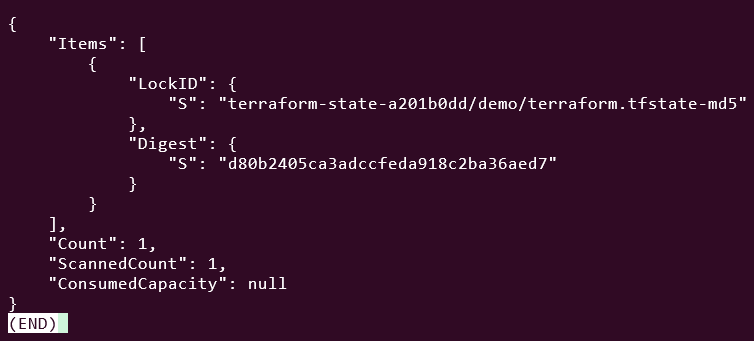

# Step 11: Inspect State Commands

# List resources (reads from S3)
```
terraform state list
```

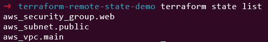

# Show specific resource
terraform state show aws_vpc.main

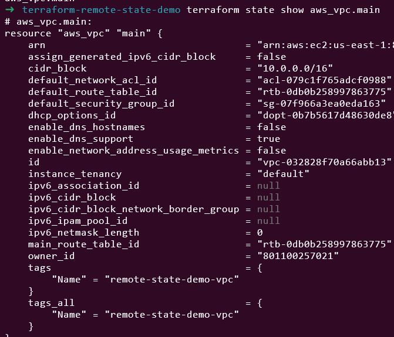

# Pull state locally for inspection
```
terraform state pull > local_state.json
cat local_state.json | jq '.resources'
```

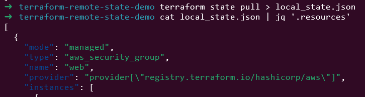

# Step 12: Clean Up

# Destroy project resources
```
terraform destroy
```

# Go back and destroy backend infrastructure
```
cd ../terraform-state-backend
terraform destroy
```

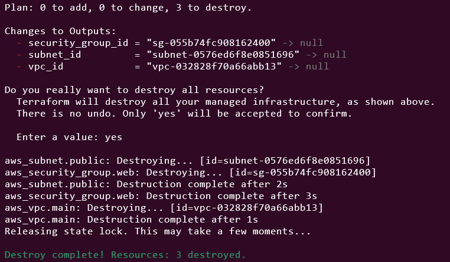

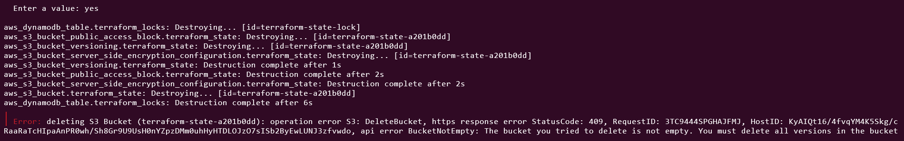

Please delete S3 by manual and then 
```
terraform destroy
```

📝 Summary

Today I learned:

✅ What Terraform state is and why it exists

✅ State file structure and contents

✅ State security considerations

✅ Essential state commands

✅ Local vs remote state

✅ S3 + DynamoDB backend setup

✅ State locking mechanism

✅ State best practices and troubleshooting

🎉 Week 1 Complete!

Congratulations! I've completed Week 1 and learned:

Infrastructure as Code fundamentals

Terraform installation and setup

Providers and their configuration

Variables and outputs

Resource dependencies and data sources

State management

💭 Weekend Challenge

Create a remote state backend in your AWS account

Build a multi-tier application with remote state

Practice state commands

Set up separate states for dev and prod

# Phase 1: Create Remote State Backend
# Step 1: Create S3 Bucket and DynamoDB Table
```
mkdir terraform-weekend-challenge
cd terraform-weekend-challenge
```

Create backend-setup.tf:
```
# backend-setup.tf
terraform {
  required_version = ">= 1.0"
  required_providers {
    aws = {
      source  = "hashicorp/aws"
      version = "~> 5.0"
    }
  }
}

provider "aws" {
  region  = "us-east-1"
}

# Create unique S3 bucket for Terraform state
resource "random_pet" "bucket_name" {
  length = 2
}

resource "aws_s3_bucket" "terraform_state" {
  bucket = "terraform-state-${random_pet.bucket_name.id}"

  tags = {
    Name        = "Terraform State Storage"
    Environment = "Global"
  }
}

resource "aws_s3_bucket_versioning" "terraform_state" {
  bucket = aws_s3_bucket.terraform_state.id
  versioning_configuration {
    status = "Enabled"
  }
}

resource "aws_s3_bucket_server_side_encryption_configuration" "terraform_state" {
  bucket = aws_s3_bucket.terraform_state.id

  rule {
    apply_server_side_encryption_by_default {
      sse_algorithm = "AES256"
    }
  }
}

# Create DynamoDB table for state locking
resource "aws_dynamodb_table" "terraform_state_lock" {
  name           = "terraform-state-lock"
  billing_mode   = "PAY_PER_REQUEST"
  hash_key       = "LockID"

  attribute {
    name = "LockID"
    type = "S"
  }

  tags = {
    Name = "Terraform State Lock Table"
  }
}

output "s3_bucket_name" {
  description = "S3 bucket name for Terraform state"
  value       = aws_s3_bucket.terraform_state.bucket
  sensitive   = false
}

output "dynamodb_table_name" {
  description = "DynamoDB table name for state locking"
  value       = aws_dynamodb_table.terraform_state_lock.name
}
```

# Deploy backend infrastructure
```
terraform init
terraform apply
```
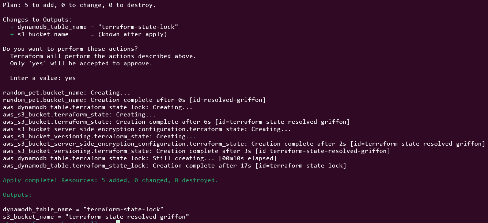

Save the bucket name and DynamoDB table name!

# Phase 2: Create Multi-Tier Application with Separate States
# Step 2: Create Directory Structure

# Create environment directories
```
mkdir dev prod
```

# Step 3: Create Dev Environment

Create dev/main.tf:
```
# dev/main.tf
terraform {
  required_version = ">= 1.0"
  required_providers {
    aws = {
      source  = "hashicorp/aws"
      version = "~> 5.0"
    }
  }

  backend "s3" {
    # Will be configured via backend.hcl
  }
}

provider "aws" {
  region  = "us-east-1"
}

# Data sources
data "aws_availability_zones" "available" {
  state = "available"
}

data "aws_ami" "amazon_linux" {
  most_recent = true
  owners      = ["amazon"]

  filter {
    name   = "name"
    values = ["amzn2-ami-hvm-*-x86_64-gp2"]
  }
}

# VPC for Dev
resource "aws_vpc" "dev_vpc" {
  cidr_block           = "10.1.0.0/16"
  enable_dns_hostnames = true

  tags = {
    Name        = "dev-vpc"
    Environment = "dev"
  }
}

# Internet Gateway
resource "aws_internet_gateway" "dev_igw" {
  vpc_id = aws_vpc.dev_vpc.id

  tags = {
    Name        = "dev-igw"
    Environment = "dev"
  }
}

# Public Subnets
resource "aws_subnet" "dev_public_subnets" {
  count = 2

  vpc_id                  = aws_vpc.dev_vpc.id
  cidr_block              = "10.1.${count.index + 1}.0/24"
  availability_zone       = data.aws_availability_zones.available.names[count.index]
  map_public_ip_on_launch = true

  tags = {
    Name        = "dev-public-${count.index + 1}"
    Environment = "dev"
  }
}

# Route Table
resource "aws_route_table" "dev_public_rt" {
  vpc_id = aws_vpc.dev_vpc.id

  route {
    cidr_block = "0.0.0.0/0"
    gateway_id = aws_internet_gateway.dev_igw.id
  }

  tags = {
    Name        = "dev-public-rt"
    Environment = "dev"
  }
}

# Route Table Associations
resource "aws_route_table_association" "dev_public_rta" {
  count = 2

  subnet_id      = aws_subnet.dev_public_subnets[count.index].id
  route_table_id = aws_route_table.dev_public_rt.id
}

# Security Group
resource "aws_security_group" "dev_web_sg" {
  name        = "dev-web-sg"
  description = "Dev web security group"
  vpc_id      = aws_vpc.dev_vpc.id

  ingress {
    from_port   = 80
    to_port     = 80
    protocol    = "tcp"
    cidr_blocks = ["0.0.0.0/0"]
  }

  ingress {
    from_port   = 22
    to_port     = 22
    protocol    = "tcp"
    cidr_blocks = ["0.0.0.0/0"]
  }

  egress {
    from_port   = 0
    to_port     = 0
    protocol    = "-1"
    cidr_blocks = ["0.0.0.0/0"]
  }

  tags = {
    Environment = "dev"
  }
}

# EC2 Instances - Web Tier
resource "aws_instance" "dev_web_servers" {
  count = 2

  ami                    = data.aws_ami.amazon_linux.id
  instance_type          = "t2.micro"
  subnet_id              = aws_subnet.dev_public_subnets[count.index].id
  vpc_security_group_ids = [aws_security_group.dev_web_sg.id]

  user_data = <<-EOF
              #!/bin/bash
              yum update -y
              yum install -y httpd
              systemctl start httpd
              systemctl enable httpd
              echo "<h1>Hello from DEV Environment - Server $((${count.index} + 1))</h1>" > /var/www/html/index.html
              echo "<p>Instance ID: $(curl -s http://169.254.169.254/latest/meta-data/instance-id)</p>" >> /var/www/html/index.html
              echo "<p>Availability Zone: $(curl -s http://169.254.169.254/latest/meta-data/placement/availability-zone)</p>" >> /var/www/html/index.html
              EOF

  tags = {
    Name        = "dev-web-${count.index + 1}"
    Environment = "dev"
    Tier        = "web"
  }

  depends_on = [aws_internet_gateway.dev_igw]
}

# Outputs
output "dev_vpc_id" {
  value = aws_vpc.dev_vpc.id
}

output "dev_web_instance_ips" {
  value = aws_instance.dev_web_servers[*].public_ip
}

output "dev_web_instance_ids" {
  value = aws_instance.dev_web_servers[*].id
}
```

# Create dev/backend.hcl:
```
# dev/backend.hcl
bucket = "terraform-state-resolved-griffon"  # Replace with your bucket name
key    = "weekend-challenge/dev/terraform.tfstate"
region = "us-east-1"

dynamodb_table = "terraform-state-lock"
encrypt        = true
```

# Step 4: Create Prod Environment

Create prod/main.tf:

```
# prod/main.tf
terraform {
  required_version = ">= 1.0"
  required_providers {
    aws = {
      source  = "hashicorp/aws"
      version = "~> 5.0"
    }
  }

  backend "s3" {
    # Will be configured via backend.hcl
  }
}

provider "aws" {
  region  = "us-east-1"
}

# Data sources
data "aws_availability_zones" "available" {
  state = "available"
}

data "aws_ami" "amazon_linux" {
  most_recent = true
  owners      = ["amazon"]

  filter {
    name   = "name"
    values = ["amzn2-ami-hvm-*-x86_64-gp2"]
  }
}

# VPC for Prod
resource "aws_vpc" "prod_vpc" {
  cidr_block           = "10.2.0.0/16"
  enable_dns_hostnames = true

  tags = {
    Name        = "prod-vpc"
    Environment = "prod"
  }
}

# Internet Gateway
resource "aws_internet_gateway" "prod_igw" {
  vpc_id = aws_vpc.prod_vpc.id

  tags = {
    Name        = "prod-igw"
    Environment = "prod"
  }
}

# Public Subnets
resource "aws_subnet" "prod_public_subnets" {
  count = 2

  vpc_id                  = aws_vpc.prod_vpc.id
  cidr_block              = "10.2.${count.index + 1}.0/24"
  availability_zone       = data.aws_availability_zones.available.names[count.index]
  map_public_ip_on_launch = true

  tags = {
    Name        = "prod-public-${count.index + 1}"
    Environment = "prod"
  }
}

# Route Table
resource "aws_route_table" "prod_public_rt" {
  vpc_id = aws_vpc.prod_vpc.id

  route {
    cidr_block = "0.0.0.0/0"
    gateway_id = aws_internet_gateway.prod_igw.id
  }

  tags = {
    Name        = "prod-public-rt"
    Environment = "prod"
  }
}

# Route Table Associations
resource "aws_route_table_association" "prod_public_rta" {
  count = 2

  subnet_id      = aws_subnet.prod_public_subnets[count.index].id
  route_table_id = aws_route_table.prod_public_rt.id
}

# Security Group - More restrictive for prod
resource "aws_security_group" "prod_web_sg" {
  name        = "prod-web-sg"
  description = "Prod web security group"
  vpc_id      = aws_vpc.prod_vpc.id

  ingress {
    from_port   = 80
    to_port     = 80
    protocol    = "tcp"
    cidr_blocks = ["0.0.0.0/0"]
  }

  ingress {
    from_port   = 22
    to_port     = 22
    protocol    = "tcp"
    cidr_blocks = ["0.0.0.0/0"]  # In real prod, restrict this!
  }

  egress {
    from_port   = 0
    to_port     = 0
    protocol    = "-1"
    cidr_blocks = ["0.0.0.0/0"]
  }

  tags = {
    Environment = "prod"
  }
}

# EC2 Instances - Web Tier (larger instances for prod)
resource "aws_instance" "prod_web_servers" {
  count = 2

  ami                    = data.aws_ami.amazon_linux.id
  instance_type          = "t2.small"  # Larger than dev
  subnet_id              = aws_subnet.prod_public_subnets[count.index].id
  vpc_security_group_ids = [aws_security_group.prod_web_sg.id]

  user_data = <<-EOF
              #!/bin/bash
              yum update -y
              yum install -y httpd
              systemctl start httpd
              systemctl enable httpd
              echo "<h1>Hello from PRODUCTION Environment - Server $((${count.index} + 1))</h1>" > /var/www/html/index.html
              echo "<p>Instance ID: $(curl -s http://169.254.169.254/latest/meta-data/instance-id)</p>" >> /var/www/html/index.html
              echo "<p>Availability Zone: $(curl -s http://169.254.169.254/latest/meta-data/placement/availability-zone)</p>" >> /var/www/html/index.html
              echo "<p><strong>PRODUCTION - Handle with care!</strong></p>" >> /var/www/html/index.html
              EOF

  tags = {
    Name        = "prod-web-${count.index + 1}"
    Environment = "prod"
    Tier        = "web"
  }

  depends_on = [aws_internet_gateway.prod_igw]
}

# Outputs
output "prod_vpc_id" {
  value = aws_vpc.prod_vpc.id
}

output "prod_web_instance_ips" {
  value = aws_instance.prod_web_servers[*].public_ip
}

output "prod_web_instance_ids" {
  value = aws_instance.prod_web_servers[*].id
}
```

Create prod/backend.hcl:
```
# prod/backend.hcl
bucket = "terraform-state-resolved-griffon"  # Replace with your bucket name
key    = "weekend-challenge/prod/terraform.tfstate"
region = "us-east-1"

dynamodb_table = "terraform-state-lock"
encrypt        = true
```

# Phase 3: Deploy and Practice State Commands
# Step 5: Deploy Dev Environment
```
cd dev

# Initialize with remote backend
terraform init -backend-config=backend.hcl

# Plan and apply
terraform plan
terraform apply -auto-approve

# Practice state commands
terraform state list
terraform state show "aws_instance.dev_web_servers[0]"
terraform output
```

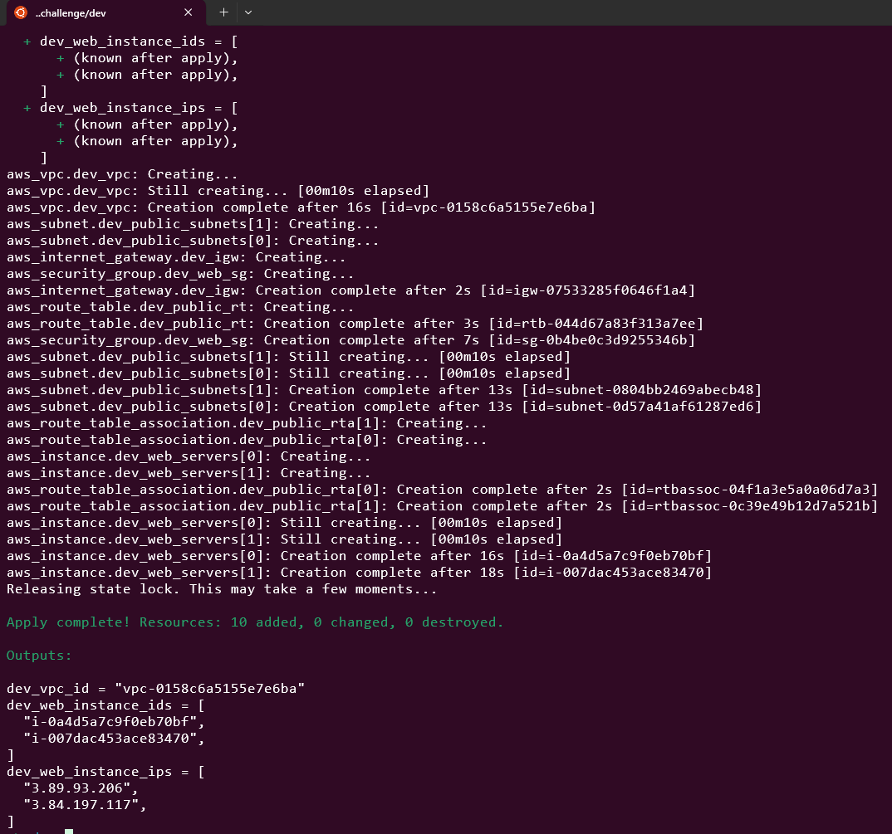

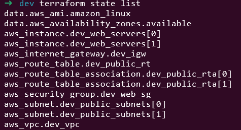

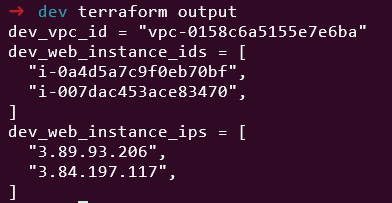

# Step 6: Deploy Prod Environment

cd ../prod

```
# Initialize with remote backend
terraform init -backend-config=backend.hcl

# Plan and apply
terraform plan
terraform apply -auto-approve

# Practice state commands
terraform state list
terraform state show aws_vpc.prod_vpc
```

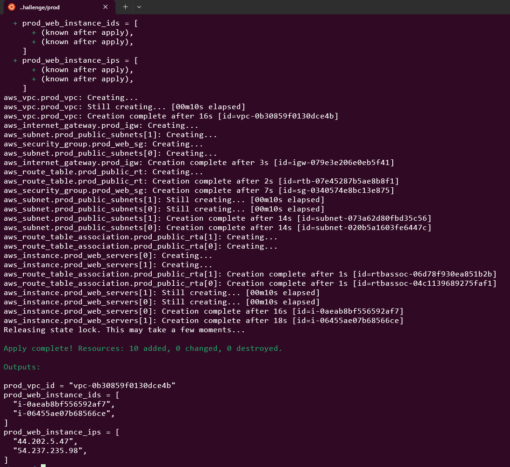

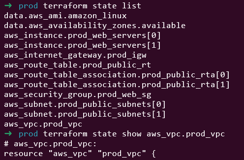

# Step 7: Verify Remote State


# Check S3 bucket contents
```
aws s3 ls s3://terraform-state-resolved-griffon/weekend-challenge/ --recursive
```

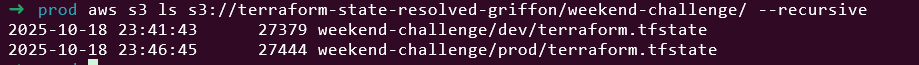

# Step 8: Test the Applications


# Get dev instance IPs and test
cd dev
terraform output dev_web_instance_ips

# Test web servers (replace with actual IPs)
curl http://DEV_INSTANCE_IP_1
curl http://DEV_INSTANCE_IP_2

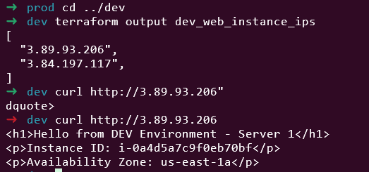

# Get prod instance IPs and test
cd ../prod
terraform output prod_web_instance_ips

# Test web servers (replace with actual IPs)
curl http://PROD_INSTANCE_IP_1
curl http://PROD_INSTANCE_IP_2

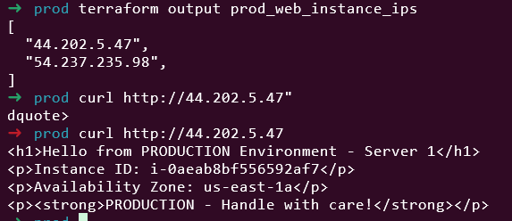

# Step 9: Cleanup


# Destroy prod environment
cd ../prod
terraform destroy -auto-approve

# Destroy dev environment
cd ../dev
terraform destroy -auto-approve

# Optional: Destroy backend
cd ..
terraform destroy -auto-approve

Please delete S3 by manual

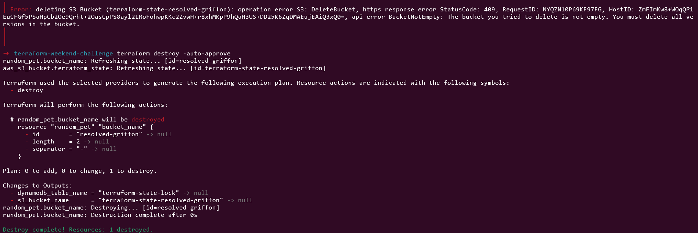

This lab was built using [StackOps - Diary](https://stackopsdiary.site/day-6-state-management-fundamentals).