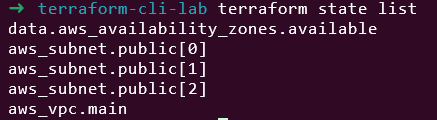

# Day 8: Terraform CLI Commands Deep Dive

🧪 Hands-On Lab: CLI Commands Mastery

Let’s practice all these commands!
# Step 1: Create Project
```
mkdir terraform-cli-lab
cd terraform-cli-lab
```

# Step 2: Create Configuration

main.tf
```
terraform {
  required_providers {
    aws = {
      source  = "hashicorp/aws"
      version = "~> 5.0"
    }
  }
}

provider "aws" {
  region = var.region
}

variable "region" {
  description = "AWS region"
  type        = string
  default     = "us-east-1"
}

variable "environment" {
  description = "Environment name"
  type        = string
  default     = "dev"
}

variable "instance_count" {
  description = "Number of instances"
  type        = number
  default     = 2
}

# VPC
resource "aws_vpc" "main" {
  cidr_block = "10.0.0.0/16"

  tags = {
    Name        = "cli-lab-vpc-${var.environment}"
    Environment = var.environment
  }
}

# Subnets
resource "aws_subnet" "public" {
  count = var.instance_count

  vpc_id            = aws_vpc.main.id
  cidr_block        = "10.0.${count.index + 1}.0/24"
  availability_zone = data.aws_availability_zones.available.names[count.index]

  tags = {
    Name = "public-subnet-${count.index + 1}"
  }
}

# Data source
data "aws_availability_zones" "available" {
  state = "available"
}

# Outputs
output "vpc_id" {
  value = aws_vpc.main.id
}

output "subnet_ids" {
  value = aws_subnet.public[*].id
}

output "region" {
  value = var.region
}
```

# Step 3: Practice Commands
Initialization
```
# Initialize
terraform init
# Check what was createdls -la .terraform/
cat .terraform.lock.hcl
```


Validation and Formatting
# Check format
terraform fmt -check

# Format files
terraform fmt

# Validate
terraform validate


Planning

# Basic plan
terraform plan

# Plan with variables
terraform plan -var="environment=staging"


# Save plan
terraform plan -out=dev.tfplan


# View saved plan
terraform show dev.tfplan


Apply

# Apply saved plan
terraform apply dev.tfplan

# Direct apply with auto-approve
terraform apply -auto-approve -var="instance_count=3"


State Operations

# List all resources
terraform state list



# Show specific resource
terraform state show aws_vpc.main


# Show subnet with index
terraform state show 'aws_subnet.public[0]'


Outputs

# All outputs
terraform output


# Specific output
terraform output vpc_id


# Raw output for scripting
terraform output -raw region


# JSON output
terraform output -json | jq


Graph Visualization

# Generate graph
terraform graph > graph.dot


# If you have Graphviz installed:
terraform graph | dot -Tpng > infrastructure.png


Targeted Operations

# Plan specific resource
terraform plan -target='aws_subnet.public[0]'


# Apply to specific resource
terraform apply -target='aws_vpc.main' -auto-approve


# Destroy specific resource
terraform destroy -target='aws_subnet.public[1]' -auto-approve


# Step 4: Practice State Manipulation

# Pull state for backup
terraform state pull > backup.tfstate

terraform state pull downloads and outputs the current state file from your backend to your local terminal. The > backup.tfstate part saves it to a file.

# List resources
terraform state list


# Move resource (rename)
terraform state mv 'aws_subnet.public[0]' aws_subnet.primary


# Show renamed resource
terraform state show aws_subnet.primary


# Move it back
terraform state mv aws_subnet.primary 'aws_subnet.public[0]'


# Step 5: Workspaces

# List workspaces
terraform workspace list


# Create new workspace
terraform workspace new staging


# Switch workspaces
terraform workspace select default
terraform workspace select staging


# Deploy to staging
terraform apply -auto-approve -var="environment=staging"


# Delete staging workspace
terraform destroy -auto-approve  


# In staging workspace first
terraform workspace select default
terraform workspace delete staging


# Step 6: Cleanup

terraform destroy -auto-approve


🎯 Command Cheat Sheet
Daily Commands

# Initialize project
terraform init 

# Format code
terraform fmt

# Check syntax
terraform validate

# Preview changes            
terraform plan              

# Apply changes
terraform apply    

# Show outputs  
terraform output   

# Delete everything
terraform destroy

Advanced

# Import existing
terraform import               

# Manage workspaces
terraform workspace            

# Manage providers
terraform providers

# Unlock state          
terraform force-unlock

📝 CLI Best Practices
✅ DO:

Always run plan before apply

terraform plan && terraform apply

Save plans for review

terraform plan -out=plan.tfplan

# Review the plan
terraform apply plan.tfplan

Use auto-approve only in automation

# In CI/CD
terraform apply -auto-approve

Format before committing

terraform fmt -recursive
git add .
git commit -m "Formatted Terraform files"

Validate regularly

terraform validate

❌ DON’T:

Don’t skip planning in production

Don’t use auto-approve interactively

Don’t forget to backup before state operations

Don’t use state push unless absolutely necessary

🐛 Debugging Commands

# Enable debug logging
export TF_LOG=DEBUG
terraform apply

# Log to file
export TF_LOG=TRACE
export TF_LOG_PATH=./terraform.log

terraform apply

# Disable logging
unset TF_LOG
unset TF_LOG_PATH

# Crash logs
cat crash.log

Log Levels:

TRACE - Most verbose

DEBUG - Debug information

INFO - General information

WARN - Warnings

ERROR - Errors only

📝 Summary

Today I learned:

✅ All essential Terraform CLI commands

✅ Command options and flags

✅ State management commands

✅ Workspace commands

✅ Debugging and troubleshooting

✅ CLI best practices

✅ Command workflows

💭 Challenge Exercise

Create a script that:

Runs terraform plan and saves to file

Checks exit code

If changes exist (exit code 2), shows the plan

Asks for confirmation before applying

Backs up state after apply

Create terraform-apply.sh

```
#!/bin/bash

echo "=== Terraform Plan & Apply Script ==="

# Run plan
terraform plan -out=plan.tfplan -detailed-exitcode
PLAN_EXIT=$?

echo "Plan exit code: $PLAN_EXIT"

if [ $PLAN_EXIT -eq 2 ]; then
    echo "=== CHANGES DETECTED ==="
    terraform show plan.tfplan
    
    read -p "Apply these changes? (yes/no): " answer
    
    if [ "$answer" = "yes" ]; then
        echo "=== BACKING UP STATE ==="
        # Create backup (even though state is empty initially)
        terraform state pull > "backup_$(date +%s).tfstate"
        
        echo "=== APPLYING CHANGES ==="
        terraform apply plan.tfplan
        
        echo "=== APPLY COMPLETE ==="
    else
        echo "Changes cancelled."
        rm -f plan.tfplan
    fi
elif [ $PLAN_EXIT -eq 0 ]; then
    echo "No changes needed."
else
    echo "Plan failed with exit code: $PLAN_EXIT"
    exit 1
fi
```

```
chmod +x terraform-apply.sh
```

# Run your script for the FIRST time (no infrastructure exists)
```
./terraform-apply.sh
```


This lab was built using [StackOps - Diary](https://stackopsdiary.site/day-8-terraform-cli-commands-deep-dive).