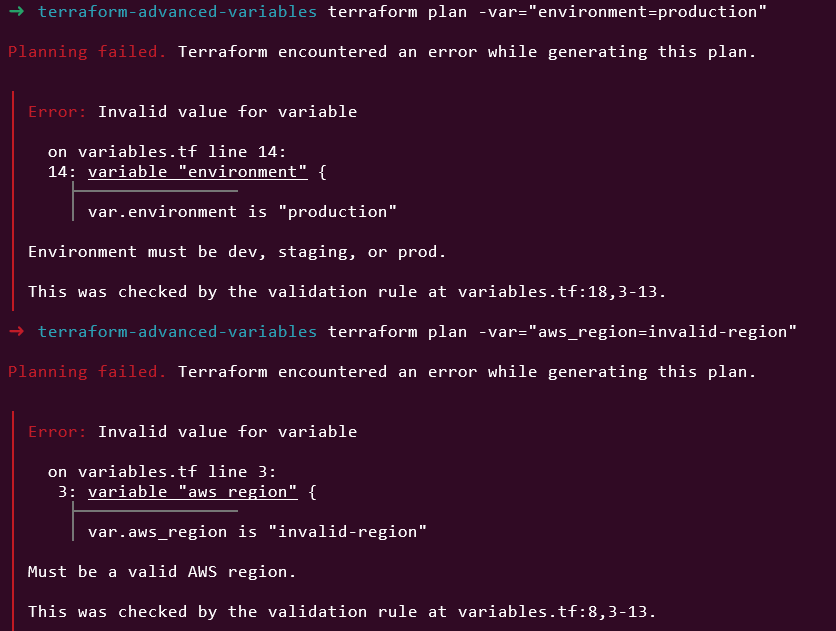
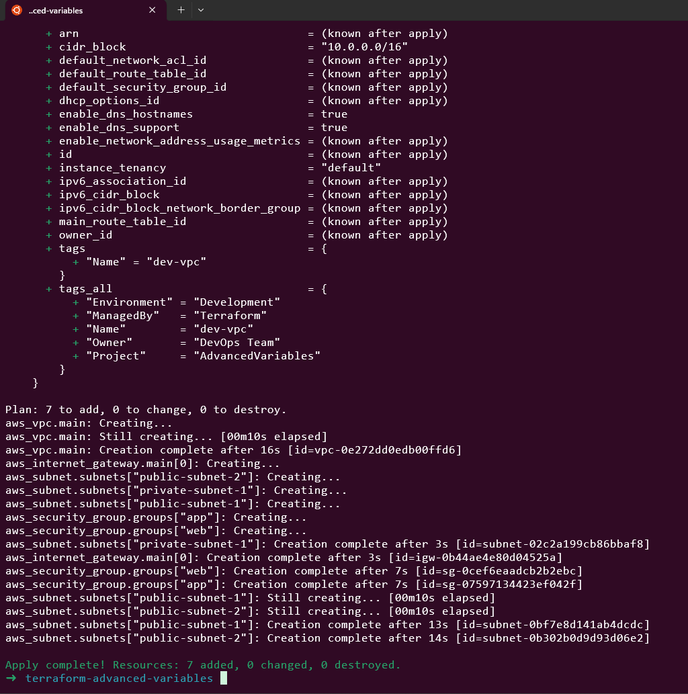
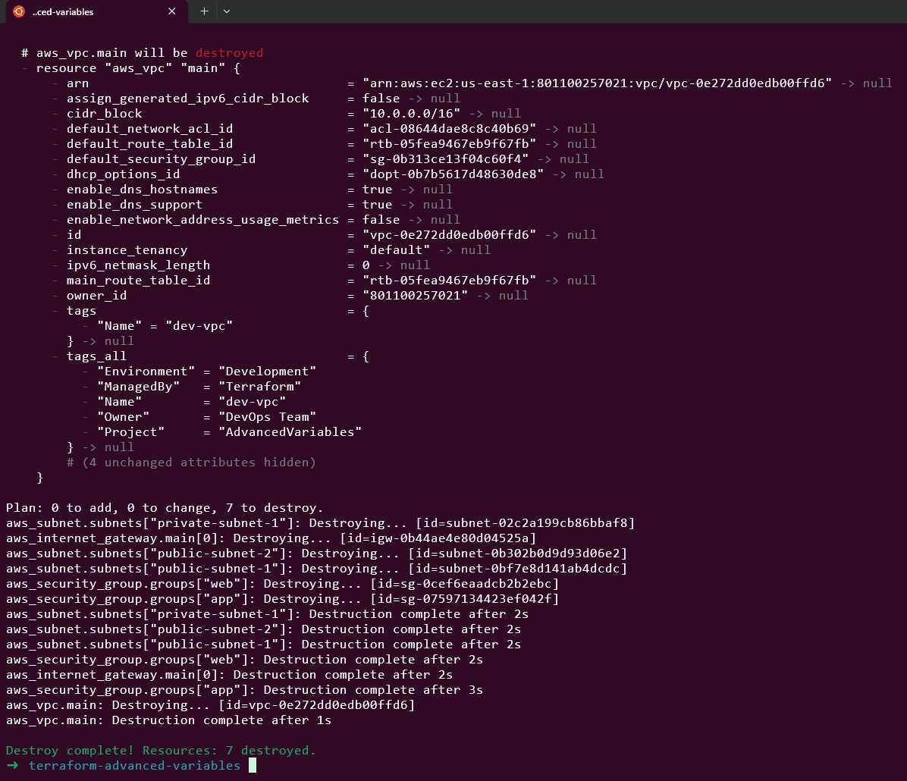

# Day 9: Input Variables - Types & Validation

🧪 Hands-On Lab: Advanced Variables

Let’s build a complete infrastructure with advanced variable types and validation!
# Step 1: Create Project

mkdir terraform-advanced-variables
cd terraform-advanced-variables

# Step 2: Create variables.tf
```
# variables.tf

variable "aws_region" {
  description = "AWS region for resources"
  type        = string
  default     = "us-east-1"

  validation {
    condition = can(regex("^(us|eu|ap|sa|ca|me|af)-(north|south|east|west|central|northeast|southeast)-[1-3]$", var.aws_region))
    error_message = "Must be a valid AWS region."
  }
}

variable "environment" {
  description = "Environment name"
  type        = string

  validation {
    condition     = contains(["dev", "staging", "prod"], var.environment)
    error_message = "Environment must be dev, staging, or prod."
  }
}

variable "vpc_config" {
  description = "VPC configuration"
  type = object({
    cidr_block           = string
    enable_dns_hostnames = bool
    enable_dns_support   = bool
    enable_nat_gateway   = bool
  })

  validation {
    condition     = can(cidrhost(var.vpc_config.cidr_block, 0))
    error_message = "VPC CIDR block must be valid."
  }
}

variable "subnets" {
  description = "Subnet configurations"
  type = list(object({
    name              = string
    cidr_block        = string
    availability_zone = string
    type              = string  # "public" or "private"
  }))

  validation {
    condition = alltrue([
      for subnet in var.subnets :
      contains(["public", "private"], subnet.type)
    ])
    error_message = "Subnet type must be either 'public' or 'private'."
  }

  validation {
    condition = alltrue([
      for subnet in var.subnets :
      can(cidrhost(subnet.cidr_block, 0))
    ])
    error_message = "All subnet CIDR blocks must be valid."
  }
}

variable "security_groups" {
  description = "Security group configurations"
  type = map(object({
    description = string
    ingress_rules = list(object({
      from_port   = number
      to_port     = number
      protocol    = string
      cidr_blocks = list(string)
      description = string
    }))
  }))
}

variable "instance_configs" {
  description = "EC2 instance configurations"
  type = map(object({
    instance_type = string
    count         = number
    subnet_type   = string
    security_groups = list(string)
  }))

  validation {
    condition = alltrue([
      for key, config in var.instance_configs :
      config.count >= 0 && config.count <= 10
    ])
    error_message = "Instance count must be between 0 and 10."
  }
}

variable "tags" {
  description = "Common tags for all resources"
  type        = map(string)

  validation {
    condition = alltrue([
      contains(keys(var.tags), "Project"),
      contains(keys(var.tags), "Owner"),
    ])
    error_message = "Tags must include Project and Owner."
  }
}

variable "enable_backup" {
  description = "Enable automated backups"
  type        = bool
  default     = true
}
```

# Step 3: Create terraform.tfvars

```
# terraform.tfvars

aws_region  = "us-east-1"
environment = "dev"

vpc_config = {
  cidr_block           = "10.0.0.0/16"
  enable_dns_hostnames = true
  enable_dns_support   = true
  enable_nat_gateway   = false
}

subnets = [
  {
    name              = "public-subnet-1"
    cidr_block        = "10.0.1.0/24"
    availability_zone = "us-east-1a"
    type              = "public"
  },
  {
    name              = "public-subnet-2"
    cidr_block        = "10.0.2.0/24"
    availability_zone = "us-east-1b"
    type              = "public"
  },
  {
    name              = "private-subnet-1"
    cidr_block        = "10.0.10.0/24"
    availability_zone = "us-east-1a"
    type              = "private"
  }
]

security_groups = {
  web = {
    description = "Security group for web servers"
    ingress_rules = [
      {
        from_port   = 80
        to_port     = 80
        protocol    = "tcp"
        cidr_blocks = ["0.0.0.0/0"]
        description = "HTTP from anywhere"
      },
      {
        from_port   = 443
        to_port     = 443
        protocol    = "tcp"
        cidr_blocks = ["0.0.0.0/0"]
        description = "HTTPS from anywhere"
      }
    ]
  }
  app = {
    description = "Security group for application servers"
    ingress_rules = [
      {
        from_port   = 8080
        to_port     = 8080
        protocol    = "tcp"
        cidr_blocks = ["10.0.0.0/16"]
        description = "App port from VPC"
      }
    ]
  }
}

instance_configs = {
  web = {
    instance_type   = "t2.micro"
    count           = 2
    subnet_type     = "public"
    security_groups = ["web"]
  }
  app = {
    instance_type   = "t2.small"
    count           = 2
    subnet_type     = "private"
    security_groups = ["app"]
  }
}

tags = {
  Project     = "AdvancedVariables"
  Owner       = "DevOps Team"
  Environment = "Development"
  ManagedBy   = "Terraform"
}

enable_backup = true
```

# Step 4: Create main.tf

```
# main.tf

terraform {
  required_version = ">= 1.0"
  required_providers {
    aws = {
      source  = "hashicorp/aws"
      version = "~> 5.0"
    }
  }
}

provider "aws" {
  region = var.aws_region

  default_tags {
    tags = var.tags
  }
}

# VPC
resource "aws_vpc" "main" {
  cidr_block           = var.vpc_config.cidr_block
  enable_dns_hostnames = var.vpc_config.enable_dns_hostnames
  enable_dns_support   = var.vpc_config.enable_dns_support

  tags = {
    Name = "${var.environment}-vpc"
  }
}

# Internet Gateway (for public subnets)
resource "aws_internet_gateway" "main" {
  count = length([for s in var.subnets : s if s.type == "public"]) > 0 ? 1 : 0

  vpc_id = aws_vpc.main.id

  tags = {
    Name = "${var.environment}-igw"
  }
}

# Subnets
resource "aws_subnet" "subnets" {
  for_each = { for idx, subnet in var.subnets : subnet.name => subnet }

  vpc_id                  = aws_vpc.main.id
  cidr_block              = each.value.cidr_block
  availability_zone       = each.value.availability_zone
  map_public_ip_on_launch = each.value.type == "public"

  tags = {
    Name = each.value.name
    Type = each.value.type
  }
}

# Security Groups
resource "aws_security_group" "groups" {
  for_each = var.security_groups

  name        = "${var.environment}-${each.key}-sg"
  description = each.value.description
  vpc_id      = aws_vpc.main.id

  dynamic "ingress" {
    for_each = each.value.ingress_rules
    content {
      from_port   = ingress.value.from_port
      to_port     = ingress.value.to_port
      protocol    = ingress.value.protocol
      cidr_blocks = ingress.value.cidr_blocks
      description = ingress.value.description
    }
  }

  egress {
    from_port   = 0
    to_port     = 0
    protocol    = "-1"
    cidr_blocks = ["0.0.0.0/0"]
  }

  tags = {
    Name = "${var.environment}-${each.key}-sg"
  }
}
```

# Step 5: Test Validation
```
# Initialize
terraform init
# Test with invalid environment
terraform plan -var="environment=production"
# Error: Environment must be dev, staging, or prod.
# Test with invalid region
terraform plan -var="aws_region=invalid-region"
# Error: Must be a valid AWS region.
# Test with valid values
terraform plan
```



# Step 6: Test Different Environments

Create prod.tfvars:

```
environment = "prod"

vpc_config = {
  cidr_block           = "172.16.0.0/16"
  enable_dns_hostnames = true
  enable_dns_support   = true
  enable_nat_gateway   = true
}

instance_configs = {
  web = {
    instance_type   = "t3.medium"
    count           = 4
    subnet_type     = "public"
    security_groups = ["web"]
  }
}
```

```
terraform plan -var-file="prod.tfvars"
```

# Step 7: Apply and Clean Up

# Apply
terraform apply -auto-approve



# Destroy
terraform destroy -auto-approve



📝 Variable Best Practices
✅ DO:

Always specify types

Add descriptions

Use validation for critical values

Provide sensible defaults

Use complex types when appropriate

Document validation rules

❌ DON’T:

Don’t use any type unless necessary

Don’t skip validation for user input

Don’t make everything a variable

Don’t use overly complex nested types

📝 Summary

Today I learned:

✅ All Terraform variable types

✅ Complex type constructors (list, map, object, tuple)

✅ Advanced validation techniques

✅ Regex and custom validation

✅ Nested and complex types

✅ Type-safe configurations


This lab was built using [StackOps - Diary](https://stackopsdiary.site/day-9-input-variables-types-and-validation).

